# Logistic regression
Jose Parreno Garcia  
December 2017  
<style>
body {
text-align: justify}
</style>

<br>


```r
library(knitr)
```

In the previous section we learnt how to model and predict continuous response variables. In this section we will learn how to deal with categorial variables:

* The concepts
* Understanding accuracy measures
* How to build and predictive model with the caret package

* How to model and predict categorical variables using:

* Logistic regression
* Naive bayes
* KNN
* rpart, cTree and C5.0
* Advanced feature selection techniques

<br>

# Logistic regression - concept:

If we use linear regression to model dichotomous (2) variable the resulting model might not restrict the predictive values to only 0 or 1. You can see in the following image how using linear regression will build a line where, at any given value of X it can many different values of Y. Opposed to that, is logistic regression, which generally shows an "s" shape. With this S shape we either achive, values very close to 0, values very close to 1 and a small region with values between 0 and 1.


In order to achieve this "s" shape, the log odds of the particular event we are trying to predict, is modelled. The aim of this section is not to demostrate the equations (remember we are doing an express course), so I will leave below the equations:


This equation can be implemented using the **glm** function by setting one of the arguments to *binomial*. In addition, when predicting, we need to ensure we put the *type=response*, if not, we will be calculating the log odds of P (Z values) instead of the actual probability. Anyway we will see this in the following sections.

<br>

# Implementing a simple logistic regression

We will be using the **BreastCancer** dataset from the **mlbenc** package. The goal for this logistic regression model will be to predict if the cases in the dataset are benign or not. In this case, the *class*, is the response variable, and the rest of the variables are factor variables.

## Getting the data 


```r
require(mlbench)
data(BreastCancer, package = 'mlbench')
bc = BreastCancer[complete.cases(BreastCancer), ]

# Checking the dataset
str(bc)
```

```
## 'data.frame':	683 obs. of  11 variables:
##  $ Id             : chr  "1000025" "1002945" "1015425" "1016277" ...
##  $ Cl.thickness   : Ord.factor w/ 10 levels "1"<"2"<"3"<"4"<..: 5 5 3 6 4 8 1 2 2 4 ...
##  $ Cell.size      : Ord.factor w/ 10 levels "1"<"2"<"3"<"4"<..: 1 4 1 8 1 10 1 1 1 2 ...
##  $ Cell.shape     : Ord.factor w/ 10 levels "1"<"2"<"3"<"4"<..: 1 4 1 8 1 10 1 2 1 1 ...
##  $ Marg.adhesion  : Ord.factor w/ 10 levels "1"<"2"<"3"<"4"<..: 1 5 1 1 3 8 1 1 1 1 ...
##  $ Epith.c.size   : Ord.factor w/ 10 levels "1"<"2"<"3"<"4"<..: 2 7 2 3 2 7 2 2 2 2 ...
##  $ Bare.nuclei    : Factor w/ 10 levels "1","2","3","4",..: 1 10 2 4 1 10 10 1 1 1 ...
##  $ Bl.cromatin    : Factor w/ 10 levels "1","2","3","4",..: 3 3 3 3 3 9 3 3 1 2 ...
##  $ Normal.nucleoli: Factor w/ 10 levels "1","2","3","4",..: 1 2 1 7 1 7 1 1 1 1 ...
##  $ Mitoses        : Factor w/ 9 levels "1","2","3","4",..: 1 1 1 1 1 1 1 1 5 1 ...
##  $ Class          : Factor w/ 2 levels "benign","malignant": 1 1 1 1 1 2 1 1 1 1 ...
```

```r
summary(bc)
```

```
##       Id             Cl.thickness   Cell.size     Cell.shape  Marg.adhesion  Epith.c.size  Bare.nuclei   Bl.cromatin  Normal.nucleoli    Mitoses          Class    
##  Length:683         1      :139   1      :373   1      :346   1      :393   2      :376   1      :402   3      :161   1      :432     1      :563   benign   :444  
##  Class :character   5      :128   10     : 67   2      : 58   2      : 58   3      : 71   10     :132   2      :160   10     : 60     2      : 35   malignant:239  
##  Mode  :character   3      :104   3      : 52   10     : 58   3      : 58   4      : 48   2      : 30   1      :150   3      : 42     3      : 33                  
##                     4      : 79   2      : 45   3      : 53   10     : 55   1      : 44   5      : 30   7      : 71   2      : 36     10     : 14                  
##                     10     : 69   4      : 38   4      : 43   4      : 33   6      : 40   3      : 28   4      : 39   8      : 23     4      : 12                  
##                     2      : 50   5      : 30   5      : 32   8      : 25   5      : 39   8      : 21   5      : 34   6      : 22     7      :  9                  
##                     (Other):114   (Other): 78   (Other): 93   (Other): 61   (Other): 65   (Other): 40   (Other): 68   (Other): 68     (Other): 17
```

## Simple preprocessing

As you can observe:

* There is an ID column. We dont really want this, so we will take it out.
* The first variables seem to be ordered factors, so we could change these to numeric. To be clear, to do this, we need to be careful and first transform the factor into a character, and then into a number. If not, the values can be messed up. Anyway, this is an optional step.
* Change the name of the class to a factor of 0 and 1


```r
# Deleting first column
bc = bc[, -which(colnames(bc) == "Id")]

# Transforming ordered factors into numeric 
for(i in 1:9){
  bc[,i] = as.numeric(as.character(bc[,i]))
}

# Changing naming of the response variable
bc$Class = ifelse(bc$Class == "malignant",1,0)
bc$Class = factor(bc$Class, levels = c(0,1))
```

## Splitting

As you can see from the table function, there is some class imbalance (not much compared to other problems), but still there is. We could do any of the following:

* We need to ensure that any samples we create have the same distribution of classes. So if you want to create the train or test samples directly with this unbalanced classes, then ensure you use the **sample.split()** function.
* However, given that I assume you know how to do this from the previous section, we can look at the concepts of **downsizing, upsampling and hybrid between both**.
* Basically, downsizing is taking the majority class data (in this case the cases without cancer), and picking random records until to match approximantely the number of records in the minority class (in this case 239 cases).
* Upsizing is the opposite. Taking the minority class and randomnly duplicating cases, until you reach approximantely the number of cases in the majority class.
* HYbrid is a bit more complex, but basically there are a couple of widely used algorithms for this: the SMOTE and the ROSE algorithm.


```r
table(bc$Class)
```

```
## 
##   0   1 
## 444 239
```

```r
# Creating Train and Test data using the caret package
library(caret)

# Define the not in function
'%ni%' = Negate('%in%')

# Prevent priting scientific notation
options(scipen = 999)

# Prep train and test 
set.seed(100)
trainDataIndex = createDataPartition(bc$Class, p = 0.7, list = F)
trainData = bc[trainDataIndex,]
testData = bc[-trainDataIndex,]

# Downsampling
down_train = downSample(x = trainData[, colnames(trainData) %ni% "Class"]
                        , y = trainData$Class)

table(down_train$Class)
```

```
## 
##   0   1 
## 168 168
```

```r
# Upsampling
up_train = upSample(x = trainData[, colnames(trainData) %ni% "Class"]
                        , y = trainData$Class)

table(up_train$Class)
```

```
## 
##   0   1 
## 311 311
```

## First model using the down sample set

We use the down sample train data to model our first model. Then we can test it on the initial train/test datasets.


```r
# Building the model with the down sized data. Ensure you add family binomial
logitmod = glm(Class ~ Cl.thickness + Cell.size + Cell.shape, family = binomial, data = down_train)
summary(logitmod)
```

```
## 
## Call:
## glm(formula = Class ~ Cl.thickness + Cell.size + Cell.shape, 
##     family = binomial, data = down_train)
## 
## Deviance Residuals: 
##     Min       1Q   Median       3Q      Max  
## -4.1657  -0.1831  -0.0531   0.0549   2.6734  
## 
## Coefficients:
##              Estimate Std. Error z value          Pr(>|z|)    
## (Intercept)   -7.2793     0.9557  -7.617 0.000000000000026 ***
## Cl.thickness   0.5353     0.1367   3.917 0.000089628283919 ***
## Cell.size      0.7427     0.2798   2.655           0.00794 ** 
## Cell.shape     0.8503     0.2672   3.183           0.00146 ** 
## ---
## Signif. codes:  0 '***' 0.001 '**' 0.01 '*' 0.05 '.' 0.1 ' ' 1
## 
## (Dispersion parameter for binomial family taken to be 1)
## 
##     Null deviance: 465.79  on 335  degrees of freedom
## Residual deviance:  90.23  on 332  degrees of freedom
## AIC: 98.23
## 
## Number of Fisher Scoring iterations: 8
```

```r
# Predict the probability of the event for each observation
pred = predict(logitmod, newdata = testData, type = "response")
head(pred)
```

```
##          1          2          5          8         13         15 
## 0.04699168 0.85436794 0.02805903 0.02263590 0.54396155 0.99842756
```

As you can see, we have calculated probabilites of each record. What we haven't assigned, is those probabilites to a certain class. Common practice is to start simple and have a treshold of 0.5, meaning that anything below that will get assigned to 0 and anything above, will get assigned to 1. We will do this, but the threshold is something we could play with depending on our goal metrics. We will talk about this later.


```r
# Converting the probabilites to class predictions
y_pred_num = ifelse(pred > 0.5, 1, 0)
y_pred = factor(y_pred_num, levels = c(0,1))
y_act = testData$Class
```

## Confusion matrix for this first model

You can see that the first model has initially an accuracy of 94%. That is encouraging, but let's think about this for a moment. If we had a problem where we had 100 records, being 99 of those benign and only 1 cancer, then we could have a 99% accuracy if we predicted that all of them where benign (ie we would be only making one error). However, that error is the one that we actually want to predict, therefore, accuracy is not the metric we want to use. 

That is why we compute the confusion matrix. In the confusion metric we can see:
*  Accuracy
* Sensitivity, which represents the proportion of actual positive events that the model predicted as a positive event. In this case, 70/(70+1)
* Specificity, is the proportion of non positive events (ie class 0) that the model predicted correctly, 122/(122+11)

In our case, specificity would be very important to us, and we see that out of 71 cases, we are actually predicting 70 correctly! Quite a good start.


```r
# Accuracy
mean(y_pred == y_act)
```

```
## [1] 0.9411765
```

```r
# Confusion matrix
caret::confusionMatrix(y_pred, y_act, positive = "1")
```

```
## Confusion Matrix and Statistics
## 
##           Reference
## Prediction   0   1
##          0 122   1
##          1  11  70
##                                                
##                Accuracy : 0.9412               
##                  95% CI : (0.8995, 0.9692)     
##     No Information Rate : 0.652                
##     P-Value [Acc > NIR] : < 0.00000000000000022
##                                                
##                   Kappa : 0.8745               
##  Mcnemar's Test P-Value : 0.009375             
##                                                
##             Sensitivity : 0.9859               
##             Specificity : 0.9173               
##          Pos Pred Value : 0.8642               
##          Neg Pred Value : 0.9919               
##              Prevalence : 0.3480               
##          Detection Rate : 0.3431               
##    Detection Prevalence : 0.3971               
##       Balanced Accuracy : 0.9516               
##                                                
##        'Positive' Class : 1                    
## 
```

Remember how we assigned a threshold before to define a class based on the probability we calculated? Well, this threshold is want will determine the metrics we just mentioned. As an example, imagine that we were very conservative, and we want to flag any possible case of cancer if we detect the slightest symptom, then our threshold would be quite low. This would surely increase our sensitivity, probably making it 100%, but we would making more errors with the non-cancer cases, ie reducing specificity. Let's check that very quickly below.


```r
y_pred_num1 = ifelse(pred > 0.1, 1, 0)
y_pred1 = factor(y_pred_num1, levels = c(0,1))
y_act1 = testData$Class

caret::confusionMatrix(y_pred1, y_act1, positive = "1")
```

```
## Confusion Matrix and Statistics
## 
##           Reference
## Prediction   0   1
##          0 109   0
##          1  24  71
##                                              
##                Accuracy : 0.8824             
##                  95% CI : (0.83, 0.9231)     
##     No Information Rate : 0.652              
##     P-Value [Acc > NIR] : 0.00000000000005102
##                                              
##                   Kappa : 0.7597             
##  Mcnemar's Test P-Value : 0.00000266795459362
##                                              
##             Sensitivity : 1.0000             
##             Specificity : 0.8195             
##          Pos Pred Value : 0.7474             
##          Neg Pred Value : 1.0000             
##              Prevalence : 0.3480             
##          Detection Rate : 0.3480             
##    Detection Prevalence : 0.4657             
##       Balanced Accuracy : 0.9098             
##                                              
##        'Positive' Class : 1                  
## 
```

This example shows how building a logistic model also involves some tradeoff between our goal metrics. One way to go about his is just how i've done it, which is manually changing and reviewing results. Another much more intelligent way is using the ROC curves.

## ROC curve

With this curve, we can plot the results of sensitivity and specificity and check what threshold achieves the balance we want to have. 

* One plot we can make is to use te area under the ROC curve. This is a proxy for accuracy.
* The other plot is adding the threshold.


```r
library(InformationValue)
plotROC(y_act, pred)
```

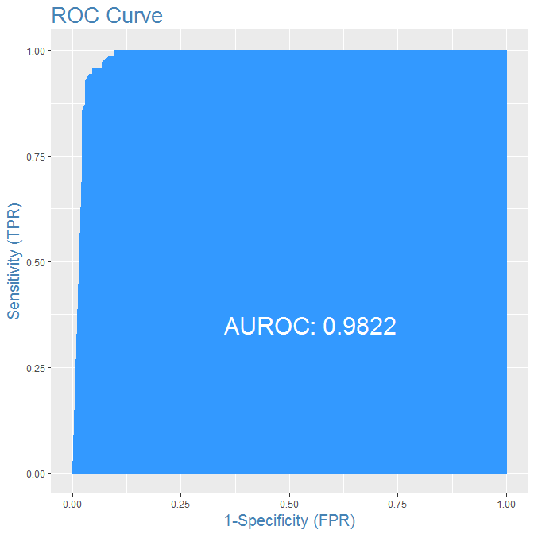<!-- -->

```r
library(ROCR)
ROCRpred = prediction(pred, y_act)
ROCRperf = performance(ROCRpred, "tpr", "fpr")
plot(ROCRperf, colorize = TRUE)
```

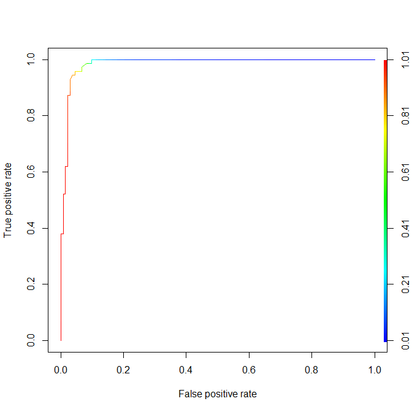<!-- -->

<br>

# Naive Bayes Classifier

We are going to look at:

* What is conditional probability?
* Bayes rules
* Naive Bayes
* Gaussian Naive Bayes
* Implemeting in R

## Conditional probability

When we speak about the probability of A given B, this is equivalent to calculating the probability of A occurring knowing that B has already occured $P(A|B)$. Numeric example below:


## Bayes Rules

From the conditional probability notation, we can derive Bayes rule. It is basically a way of calculating the unknown from the known.


## Naive Bayes

In real world problems, we typically have multiple X variables. It is called Naive because of the naive assumption that the X variales are all independent. If they were independent, we could extend the Bayes formula to what you can observe below. Just always bare in mind that the X variable are not usually all indepedent.


## Gaussian Naive Bayes

So far we have shown how would we use Naive Bayes to predict a class with multiple options. But how do we compute probabilities when the X variable is continuous?


## Implemeting in R

### Loading the data


```r
data(Vehicle, package = "mlbench")

str(Vehicle)
```

```
## 'data.frame':	846 obs. of  19 variables:
##  $ Comp        : num  95 91 104 93 85 107 97 90 86 93 ...
##  $ Circ        : num  48 41 50 41 44 57 43 43 34 44 ...
##  $ D.Circ      : num  83 84 106 82 70 106 73 66 62 98 ...
##  $ Rad.Ra      : num  178 141 209 159 205 172 173 157 140 197 ...
##  $ Pr.Axis.Ra  : num  72 57 66 63 103 50 65 65 61 62 ...
##  $ Max.L.Ra    : num  10 9 10 9 52 6 6 9 7 11 ...
##  $ Scat.Ra     : num  162 149 207 144 149 255 153 137 122 183 ...
##  $ Elong       : num  42 45 32 46 45 26 42 48 54 36 ...
##  $ Pr.Axis.Rect: num  20 19 23 19 19 28 19 18 17 22 ...
##  $ Max.L.Rect  : num  159 143 158 143 144 169 143 146 127 146 ...
##  $ Sc.Var.Maxis: num  176 170 223 160 241 280 176 162 141 202 ...
##  $ Sc.Var.maxis: num  379 330 635 309 325 957 361 281 223 505 ...
##  $ Ra.Gyr      : num  184 158 220 127 188 264 172 164 112 152 ...
##  $ Skew.Maxis  : num  70 72 73 63 127 85 66 67 64 64 ...
##  $ Skew.maxis  : num  6 9 14 6 9 5 13 3 2 4 ...
##  $ Kurt.maxis  : num  16 14 9 10 11 9 1 3 14 14 ...
##  $ Kurt.Maxis  : num  187 189 188 199 180 181 200 193 200 195 ...
##  $ Holl.Ra     : num  197 199 196 207 183 183 204 202 208 204 ...
##  $ Class       : Factor w/ 4 levels "bus","opel","saab",..: 4 4 3 4 1 1 1 4 4 3 ...
```

```r
summary(Vehicle)
```

```
##       Comp             Circ           D.Circ           Rad.Ra        Pr.Axis.Ra        Max.L.Ra         Scat.Ra          Elong        Pr.Axis.Rect     Max.L.Rect   Sc.Var.Maxis    Sc.Var.maxis        Ra.Gyr        Skew.Maxis       Skew.maxis    
##  Min.   : 73.00   Min.   :33.00   Min.   : 40.00   Min.   :104.0   Min.   : 47.00   Min.   : 2.000   Min.   :112.0   Min.   :26.00   Min.   :17.00   Min.   :118   Min.   :130.0   Min.   : 184.0   Min.   :109.0   Min.   : 59.00   Min.   : 0.000  
##  1st Qu.: 87.00   1st Qu.:40.00   1st Qu.: 70.00   1st Qu.:141.0   1st Qu.: 57.00   1st Qu.: 7.000   1st Qu.:146.2   1st Qu.:33.00   1st Qu.:19.00   1st Qu.:137   1st Qu.:167.0   1st Qu.: 318.2   1st Qu.:149.0   1st Qu.: 67.00   1st Qu.: 2.000  
##  Median : 93.00   Median :44.00   Median : 80.00   Median :167.0   Median : 61.00   Median : 8.000   Median :157.0   Median :43.00   Median :20.00   Median :146   Median :178.5   Median : 364.0   Median :173.0   Median : 71.50   Median : 6.000  
##  Mean   : 93.68   Mean   :44.86   Mean   : 82.09   Mean   :168.9   Mean   : 61.69   Mean   : 8.567   Mean   :168.8   Mean   :40.93   Mean   :20.58   Mean   :148   Mean   :188.6   Mean   : 439.9   Mean   :174.7   Mean   : 72.46   Mean   : 6.377  
##  3rd Qu.:100.00   3rd Qu.:49.00   3rd Qu.: 98.00   3rd Qu.:195.0   3rd Qu.: 65.00   3rd Qu.:10.000   3rd Qu.:198.0   3rd Qu.:46.00   3rd Qu.:23.00   3rd Qu.:159   3rd Qu.:217.0   3rd Qu.: 587.0   3rd Qu.:198.0   3rd Qu.: 75.00   3rd Qu.: 9.000  
##  Max.   :119.00   Max.   :59.00   Max.   :112.00   Max.   :333.0   Max.   :138.00   Max.   :55.000   Max.   :265.0   Max.   :61.00   Max.   :29.00   Max.   :188   Max.   :320.0   Max.   :1018.0   Max.   :268.0   Max.   :135.00   Max.   :22.000  
##    Kurt.maxis     Kurt.Maxis       Holl.Ra       Class    
##  Min.   : 0.0   Min.   :176.0   Min.   :181.0   bus :218  
##  1st Qu.: 5.0   1st Qu.:184.0   1st Qu.:190.2   opel:212  
##  Median :11.0   Median :188.0   Median :197.0   saab:217  
##  Mean   :12.6   Mean   :188.9   Mean   :195.6   van :199  
##  3rd Qu.:19.0   3rd Qu.:193.0   3rd Qu.:201.0             
##  Max.   :41.0   Max.   :206.0   Max.   :211.0
```

### Small checks on the data - featurePlot

Usually, the useful feature is the one that has significant shifts in the mean value across the different classes. Think it the other way round, if all vehicle classes output the same mean for a variable, then that variable is not going to be very helpful in differentiating amongst the cars. In the plot below you can check Sc.Var.maxis is a good candidate variable.


```r
featurePlot(Vehicle[,-19], Vehicle[,19], plot = "box")
```

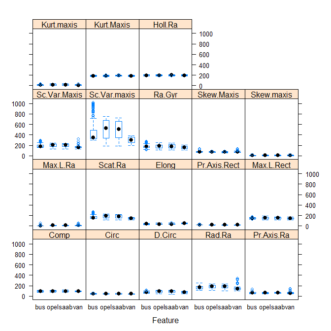<!-- -->

### Sampling the data


```r
set.seed(100)

train_rows = createDataPartition(Vehicle$Class, p = 0.7, list = F)
train = Vehicle[train_rows, ]
test = Vehicle[-train_rows, ]
```

### Train the model with Naive Bayes


```r
library(klaR)

nb_mod = NaiveBayes(Class ~ ., data = train)
pred = predict(nb_mod, test)
```

```
## Warning in FUN(X[[i]], ...): Numerical 0 probability for all classes with observation 1
```

```
## Warning in FUN(X[[i]], ...): Numerical 0 probability for all classes with observation 2
```

```
## Warning in FUN(X[[i]], ...): Numerical 0 probability for all classes with observation 3
```

```
## Warning in FUN(X[[i]], ...): Numerical 0 probability for all classes with observation 4
```

```
## Warning in FUN(X[[i]], ...): Numerical 0 probability for all classes with observation 5
```

```
## Warning in FUN(X[[i]], ...): Numerical 0 probability for all classes with observation 6
```

```
## Warning in FUN(X[[i]], ...): Numerical 0 probability for all classes with observation 7
```

```
## Warning in FUN(X[[i]], ...): Numerical 0 probability for all classes with observation 8
```

```
## Warning in FUN(X[[i]], ...): Numerical 0 probability for all classes with observation 9
```

```
## Warning in FUN(X[[i]], ...): Numerical 0 probability for all classes with observation 10
```

```
## Warning in FUN(X[[i]], ...): Numerical 0 probability for all classes with observation 11
```

```
## Warning in FUN(X[[i]], ...): Numerical 0 probability for all classes with observation 12
```

```
## Warning in FUN(X[[i]], ...): Numerical 0 probability for all classes with observation 13
```

```
## Warning in FUN(X[[i]], ...): Numerical 0 probability for all classes with observation 14
```

```
## Warning in FUN(X[[i]], ...): Numerical 0 probability for all classes with observation 15
```

```
## Warning in FUN(X[[i]], ...): Numerical 0 probability for all classes with observation 16
```

```
## Warning in FUN(X[[i]], ...): Numerical 0 probability for all classes with observation 17
```

```
## Warning in FUN(X[[i]], ...): Numerical 0 probability for all classes with observation 18
```

```
## Warning in FUN(X[[i]], ...): Numerical 0 probability for all classes with observation 19
```

```
## Warning in FUN(X[[i]], ...): Numerical 0 probability for all classes with observation 20
```

```
## Warning in FUN(X[[i]], ...): Numerical 0 probability for all classes with observation 21
```

```
## Warning in FUN(X[[i]], ...): Numerical 0 probability for all classes with observation 22
```

```
## Warning in FUN(X[[i]], ...): Numerical 0 probability for all classes with observation 23
```

```
## Warning in FUN(X[[i]], ...): Numerical 0 probability for all classes with observation 24
```

```
## Warning in FUN(X[[i]], ...): Numerical 0 probability for all classes with observation 25
```

```
## Warning in FUN(X[[i]], ...): Numerical 0 probability for all classes with observation 26
```

```
## Warning in FUN(X[[i]], ...): Numerical 0 probability for all classes with observation 27
```

```
## Warning in FUN(X[[i]], ...): Numerical 0 probability for all classes with observation 28
```

```
## Warning in FUN(X[[i]], ...): Numerical 0 probability for all classes with observation 29
```

```
## Warning in FUN(X[[i]], ...): Numerical 0 probability for all classes with observation 30
```

```
## Warning in FUN(X[[i]], ...): Numerical 0 probability for all classes with observation 31
```

```
## Warning in FUN(X[[i]], ...): Numerical 0 probability for all classes with observation 32
```

```
## Warning in FUN(X[[i]], ...): Numerical 0 probability for all classes with observation 33
```

```
## Warning in FUN(X[[i]], ...): Numerical 0 probability for all classes with observation 34
```

```
## Warning in FUN(X[[i]], ...): Numerical 0 probability for all classes with observation 35
```

```
## Warning in FUN(X[[i]], ...): Numerical 0 probability for all classes with observation 36
```

```
## Warning in FUN(X[[i]], ...): Numerical 0 probability for all classes with observation 37
```

```
## Warning in FUN(X[[i]], ...): Numerical 0 probability for all classes with observation 38
```

```
## Warning in FUN(X[[i]], ...): Numerical 0 probability for all classes with observation 39
```

```
## Warning in FUN(X[[i]], ...): Numerical 0 probability for all classes with observation 40
```

```
## Warning in FUN(X[[i]], ...): Numerical 0 probability for all classes with observation 41
```

```
## Warning in FUN(X[[i]], ...): Numerical 0 probability for all classes with observation 42
```

```
## Warning in FUN(X[[i]], ...): Numerical 0 probability for all classes with observation 43
```

```
## Warning in FUN(X[[i]], ...): Numerical 0 probability for all classes with observation 44
```

```
## Warning in FUN(X[[i]], ...): Numerical 0 probability for all classes with observation 45
```

```
## Warning in FUN(X[[i]], ...): Numerical 0 probability for all classes with observation 46
```

```
## Warning in FUN(X[[i]], ...): Numerical 0 probability for all classes with observation 47
```

```
## Warning in FUN(X[[i]], ...): Numerical 0 probability for all classes with observation 48
```

```
## Warning in FUN(X[[i]], ...): Numerical 0 probability for all classes with observation 49
```

```
## Warning in FUN(X[[i]], ...): Numerical 0 probability for all classes with observation 50
```

```
## Warning in FUN(X[[i]], ...): Numerical 0 probability for all classes with observation 51
```

```
## Warning in FUN(X[[i]], ...): Numerical 0 probability for all classes with observation 52
```

```
## Warning in FUN(X[[i]], ...): Numerical 0 probability for all classes with observation 53
```

```
## Warning in FUN(X[[i]], ...): Numerical 0 probability for all classes with observation 54
```

```
## Warning in FUN(X[[i]], ...): Numerical 0 probability for all classes with observation 55
```

```
## Warning in FUN(X[[i]], ...): Numerical 0 probability for all classes with observation 56
```

```
## Warning in FUN(X[[i]], ...): Numerical 0 probability for all classes with observation 57
```

```
## Warning in FUN(X[[i]], ...): Numerical 0 probability for all classes with observation 58
```

```
## Warning in FUN(X[[i]], ...): Numerical 0 probability for all classes with observation 59
```

```
## Warning in FUN(X[[i]], ...): Numerical 0 probability for all classes with observation 60
```

```
## Warning in FUN(X[[i]], ...): Numerical 0 probability for all classes with observation 61
```

```
## Warning in FUN(X[[i]], ...): Numerical 0 probability for all classes with observation 62
```

```
## Warning in FUN(X[[i]], ...): Numerical 0 probability for all classes with observation 63
```

```
## Warning in FUN(X[[i]], ...): Numerical 0 probability for all classes with observation 64
```

```
## Warning in FUN(X[[i]], ...): Numerical 0 probability for all classes with observation 65
```

```
## Warning in FUN(X[[i]], ...): Numerical 0 probability for all classes with observation 66
```

```
## Warning in FUN(X[[i]], ...): Numerical 0 probability for all classes with observation 67
```

```
## Warning in FUN(X[[i]], ...): Numerical 0 probability for all classes with observation 68
```

```
## Warning in FUN(X[[i]], ...): Numerical 0 probability for all classes with observation 69
```

```
## Warning in FUN(X[[i]], ...): Numerical 0 probability for all classes with observation 70
```

```
## Warning in FUN(X[[i]], ...): Numerical 0 probability for all classes with observation 71
```

```
## Warning in FUN(X[[i]], ...): Numerical 0 probability for all classes with observation 72
```

```
## Warning in FUN(X[[i]], ...): Numerical 0 probability for all classes with observation 73
```

```
## Warning in FUN(X[[i]], ...): Numerical 0 probability for all classes with observation 74
```

```
## Warning in FUN(X[[i]], ...): Numerical 0 probability for all classes with observation 75
```

```
## Warning in FUN(X[[i]], ...): Numerical 0 probability for all classes with observation 76
```

```
## Warning in FUN(X[[i]], ...): Numerical 0 probability for all classes with observation 77
```

```
## Warning in FUN(X[[i]], ...): Numerical 0 probability for all classes with observation 78
```

```
## Warning in FUN(X[[i]], ...): Numerical 0 probability for all classes with observation 79
```

```
## Warning in FUN(X[[i]], ...): Numerical 0 probability for all classes with observation 80
```

```
## Warning in FUN(X[[i]], ...): Numerical 0 probability for all classes with observation 81
```

```
## Warning in FUN(X[[i]], ...): Numerical 0 probability for all classes with observation 82
```

```
## Warning in FUN(X[[i]], ...): Numerical 0 probability for all classes with observation 83
```

```
## Warning in FUN(X[[i]], ...): Numerical 0 probability for all classes with observation 84
```

```
## Warning in FUN(X[[i]], ...): Numerical 0 probability for all classes with observation 85
```

```
## Warning in FUN(X[[i]], ...): Numerical 0 probability for all classes with observation 86
```

```
## Warning in FUN(X[[i]], ...): Numerical 0 probability for all classes with observation 87
```

```
## Warning in FUN(X[[i]], ...): Numerical 0 probability for all classes with observation 88
```

```
## Warning in FUN(X[[i]], ...): Numerical 0 probability for all classes with observation 89
```

```
## Warning in FUN(X[[i]], ...): Numerical 0 probability for all classes with observation 90
```

```
## Warning in FUN(X[[i]], ...): Numerical 0 probability for all classes with observation 91
```

```
## Warning in FUN(X[[i]], ...): Numerical 0 probability for all classes with observation 92
```

```
## Warning in FUN(X[[i]], ...): Numerical 0 probability for all classes with observation 93
```

```
## Warning in FUN(X[[i]], ...): Numerical 0 probability for all classes with observation 94
```

```
## Warning in FUN(X[[i]], ...): Numerical 0 probability for all classes with observation 95
```

```
## Warning in FUN(X[[i]], ...): Numerical 0 probability for all classes with observation 96
```

```
## Warning in FUN(X[[i]], ...): Numerical 0 probability for all classes with observation 97
```

```
## Warning in FUN(X[[i]], ...): Numerical 0 probability for all classes with observation 98
```

```
## Warning in FUN(X[[i]], ...): Numerical 0 probability for all classes with observation 99
```

```
## Warning in FUN(X[[i]], ...): Numerical 0 probability for all classes with observation 100
```

```
## Warning in FUN(X[[i]], ...): Numerical 0 probability for all classes with observation 101
```

```
## Warning in FUN(X[[i]], ...): Numerical 0 probability for all classes with observation 102
```

```
## Warning in FUN(X[[i]], ...): Numerical 0 probability for all classes with observation 103
```

```
## Warning in FUN(X[[i]], ...): Numerical 0 probability for all classes with observation 104
```

```
## Warning in FUN(X[[i]], ...): Numerical 0 probability for all classes with observation 105
```

```
## Warning in FUN(X[[i]], ...): Numerical 0 probability for all classes with observation 106
```

```
## Warning in FUN(X[[i]], ...): Numerical 0 probability for all classes with observation 107
```

```
## Warning in FUN(X[[i]], ...): Numerical 0 probability for all classes with observation 108
```

```
## Warning in FUN(X[[i]], ...): Numerical 0 probability for all classes with observation 109
```

```
## Warning in FUN(X[[i]], ...): Numerical 0 probability for all classes with observation 110
```

```
## Warning in FUN(X[[i]], ...): Numerical 0 probability for all classes with observation 111
```

```
## Warning in FUN(X[[i]], ...): Numerical 0 probability for all classes with observation 112
```

```
## Warning in FUN(X[[i]], ...): Numerical 0 probability for all classes with observation 113
```

```
## Warning in FUN(X[[i]], ...): Numerical 0 probability for all classes with observation 114
```

```
## Warning in FUN(X[[i]], ...): Numerical 0 probability for all classes with observation 115
```

```
## Warning in FUN(X[[i]], ...): Numerical 0 probability for all classes with observation 116
```

```
## Warning in FUN(X[[i]], ...): Numerical 0 probability for all classes with observation 117
```

```
## Warning in FUN(X[[i]], ...): Numerical 0 probability for all classes with observation 118
```

```
## Warning in FUN(X[[i]], ...): Numerical 0 probability for all classes with observation 119
```

```
## Warning in FUN(X[[i]], ...): Numerical 0 probability for all classes with observation 120
```

```
## Warning in FUN(X[[i]], ...): Numerical 0 probability for all classes with observation 121
```

```
## Warning in FUN(X[[i]], ...): Numerical 0 probability for all classes with observation 122
```

```
## Warning in FUN(X[[i]], ...): Numerical 0 probability for all classes with observation 123
```

```
## Warning in FUN(X[[i]], ...): Numerical 0 probability for all classes with observation 124
```

```
## Warning in FUN(X[[i]], ...): Numerical 0 probability for all classes with observation 125
```

```
## Warning in FUN(X[[i]], ...): Numerical 0 probability for all classes with observation 126
```

```
## Warning in FUN(X[[i]], ...): Numerical 0 probability for all classes with observation 127
```

```
## Warning in FUN(X[[i]], ...): Numerical 0 probability for all classes with observation 128
```

```
## Warning in FUN(X[[i]], ...): Numerical 0 probability for all classes with observation 129
```

```
## Warning in FUN(X[[i]], ...): Numerical 0 probability for all classes with observation 130
```

```
## Warning in FUN(X[[i]], ...): Numerical 0 probability for all classes with observation 131
```

```
## Warning in FUN(X[[i]], ...): Numerical 0 probability for all classes with observation 132
```

```
## Warning in FUN(X[[i]], ...): Numerical 0 probability for all classes with observation 133
```

```
## Warning in FUN(X[[i]], ...): Numerical 0 probability for all classes with observation 134
```

```
## Warning in FUN(X[[i]], ...): Numerical 0 probability for all classes with observation 135
```

```
## Warning in FUN(X[[i]], ...): Numerical 0 probability for all classes with observation 136
```

```
## Warning in FUN(X[[i]], ...): Numerical 0 probability for all classes with observation 137
```

```
## Warning in FUN(X[[i]], ...): Numerical 0 probability for all classes with observation 138
```

```
## Warning in FUN(X[[i]], ...): Numerical 0 probability for all classes with observation 139
```

```
## Warning in FUN(X[[i]], ...): Numerical 0 probability for all classes with observation 140
```

```
## Warning in FUN(X[[i]], ...): Numerical 0 probability for all classes with observation 141
```

```
## Warning in FUN(X[[i]], ...): Numerical 0 probability for all classes with observation 142
```

```
## Warning in FUN(X[[i]], ...): Numerical 0 probability for all classes with observation 143
```

```
## Warning in FUN(X[[i]], ...): Numerical 0 probability for all classes with observation 144
```

```
## Warning in FUN(X[[i]], ...): Numerical 0 probability for all classes with observation 145
```

```
## Warning in FUN(X[[i]], ...): Numerical 0 probability for all classes with observation 146
```

```
## Warning in FUN(X[[i]], ...): Numerical 0 probability for all classes with observation 147
```

```
## Warning in FUN(X[[i]], ...): Numerical 0 probability for all classes with observation 148
```

```
## Warning in FUN(X[[i]], ...): Numerical 0 probability for all classes with observation 149
```

```
## Warning in FUN(X[[i]], ...): Numerical 0 probability for all classes with observation 150
```

```
## Warning in FUN(X[[i]], ...): Numerical 0 probability for all classes with observation 151
```

```
## Warning in FUN(X[[i]], ...): Numerical 0 probability for all classes with observation 152
```

```
## Warning in FUN(X[[i]], ...): Numerical 0 probability for all classes with observation 153
```

```
## Warning in FUN(X[[i]], ...): Numerical 0 probability for all classes with observation 154
```

```
## Warning in FUN(X[[i]], ...): Numerical 0 probability for all classes with observation 155
```

```
## Warning in FUN(X[[i]], ...): Numerical 0 probability for all classes with observation 156
```

```
## Warning in FUN(X[[i]], ...): Numerical 0 probability for all classes with observation 157
```

```
## Warning in FUN(X[[i]], ...): Numerical 0 probability for all classes with observation 158
```

```
## Warning in FUN(X[[i]], ...): Numerical 0 probability for all classes with observation 159
```

```
## Warning in FUN(X[[i]], ...): Numerical 0 probability for all classes with observation 160
```

```
## Warning in FUN(X[[i]], ...): Numerical 0 probability for all classes with observation 161
```

```
## Warning in FUN(X[[i]], ...): Numerical 0 probability for all classes with observation 162
```

```
## Warning in FUN(X[[i]], ...): Numerical 0 probability for all classes with observation 163
```

```
## Warning in FUN(X[[i]], ...): Numerical 0 probability for all classes with observation 164
```

```
## Warning in FUN(X[[i]], ...): Numerical 0 probability for all classes with observation 165
```

```
## Warning in FUN(X[[i]], ...): Numerical 0 probability for all classes with observation 166
```

```
## Warning in FUN(X[[i]], ...): Numerical 0 probability for all classes with observation 167
```

```
## Warning in FUN(X[[i]], ...): Numerical 0 probability for all classes with observation 168
```

```
## Warning in FUN(X[[i]], ...): Numerical 0 probability for all classes with observation 169
```

```
## Warning in FUN(X[[i]], ...): Numerical 0 probability for all classes with observation 170
```

```
## Warning in FUN(X[[i]], ...): Numerical 0 probability for all classes with observation 171
```

```
## Warning in FUN(X[[i]], ...): Numerical 0 probability for all classes with observation 172
```

```
## Warning in FUN(X[[i]], ...): Numerical 0 probability for all classes with observation 173
```

```
## Warning in FUN(X[[i]], ...): Numerical 0 probability for all classes with observation 174
```

```
## Warning in FUN(X[[i]], ...): Numerical 0 probability for all classes with observation 175
```

```
## Warning in FUN(X[[i]], ...): Numerical 0 probability for all classes with observation 176
```

```
## Warning in FUN(X[[i]], ...): Numerical 0 probability for all classes with observation 177
```

```
## Warning in FUN(X[[i]], ...): Numerical 0 probability for all classes with observation 178
```

```
## Warning in FUN(X[[i]], ...): Numerical 0 probability for all classes with observation 179
```

```
## Warning in FUN(X[[i]], ...): Numerical 0 probability for all classes with observation 180
```

```
## Warning in FUN(X[[i]], ...): Numerical 0 probability for all classes with observation 181
```

```
## Warning in FUN(X[[i]], ...): Numerical 0 probability for all classes with observation 182
```

```
## Warning in FUN(X[[i]], ...): Numerical 0 probability for all classes with observation 183
```

```
## Warning in FUN(X[[i]], ...): Numerical 0 probability for all classes with observation 184
```

```
## Warning in FUN(X[[i]], ...): Numerical 0 probability for all classes with observation 185
```

```
## Warning in FUN(X[[i]], ...): Numerical 0 probability for all classes with observation 186
```

```
## Warning in FUN(X[[i]], ...): Numerical 0 probability for all classes with observation 187
```

```
## Warning in FUN(X[[i]], ...): Numerical 0 probability for all classes with observation 188
```

```
## Warning in FUN(X[[i]], ...): Numerical 0 probability for all classes with observation 189
```

```
## Warning in FUN(X[[i]], ...): Numerical 0 probability for all classes with observation 190
```

```
## Warning in FUN(X[[i]], ...): Numerical 0 probability for all classes with observation 191
```

```
## Warning in FUN(X[[i]], ...): Numerical 0 probability for all classes with observation 192
```

```
## Warning in FUN(X[[i]], ...): Numerical 0 probability for all classes with observation 193
```

```
## Warning in FUN(X[[i]], ...): Numerical 0 probability for all classes with observation 194
```

```
## Warning in FUN(X[[i]], ...): Numerical 0 probability for all classes with observation 195
```

```
## Warning in FUN(X[[i]], ...): Numerical 0 probability for all classes with observation 196
```

```
## Warning in FUN(X[[i]], ...): Numerical 0 probability for all classes with observation 197
```

```
## Warning in FUN(X[[i]], ...): Numerical 0 probability for all classes with observation 198
```

```
## Warning in FUN(X[[i]], ...): Numerical 0 probability for all classes with observation 199
```

```
## Warning in FUN(X[[i]], ...): Numerical 0 probability for all classes with observation 200
```

```
## Warning in FUN(X[[i]], ...): Numerical 0 probability for all classes with observation 201
```

```
## Warning in FUN(X[[i]], ...): Numerical 0 probability for all classes with observation 202
```

```
## Warning in FUN(X[[i]], ...): Numerical 0 probability for all classes with observation 203
```

```
## Warning in FUN(X[[i]], ...): Numerical 0 probability for all classes with observation 204
```

```
## Warning in FUN(X[[i]], ...): Numerical 0 probability for all classes with observation 205
```

```
## Warning in FUN(X[[i]], ...): Numerical 0 probability for all classes with observation 206
```

```
## Warning in FUN(X[[i]], ...): Numerical 0 probability for all classes with observation 207
```

```
## Warning in FUN(X[[i]], ...): Numerical 0 probability for all classes with observation 208
```

```
## Warning in FUN(X[[i]], ...): Numerical 0 probability for all classes with observation 209
```

```
## Warning in FUN(X[[i]], ...): Numerical 0 probability for all classes with observation 210
```

```
## Warning in FUN(X[[i]], ...): Numerical 0 probability for all classes with observation 211
```

```
## Warning in FUN(X[[i]], ...): Numerical 0 probability for all classes with observation 212
```

```
## Warning in FUN(X[[i]], ...): Numerical 0 probability for all classes with observation 213
```

```
## Warning in FUN(X[[i]], ...): Numerical 0 probability for all classes with observation 214
```

```
## Warning in FUN(X[[i]], ...): Numerical 0 probability for all classes with observation 215
```

```
## Warning in FUN(X[[i]], ...): Numerical 0 probability for all classes with observation 216
```

```
## Warning in FUN(X[[i]], ...): Numerical 0 probability for all classes with observation 217
```

```
## Warning in FUN(X[[i]], ...): Numerical 0 probability for all classes with observation 218
```

```
## Warning in FUN(X[[i]], ...): Numerical 0 probability for all classes with observation 219
```

```
## Warning in FUN(X[[i]], ...): Numerical 0 probability for all classes with observation 220
```

```
## Warning in FUN(X[[i]], ...): Numerical 0 probability for all classes with observation 221
```

```
## Warning in FUN(X[[i]], ...): Numerical 0 probability for all classes with observation 222
```

```
## Warning in FUN(X[[i]], ...): Numerical 0 probability for all classes with observation 223
```

```
## Warning in FUN(X[[i]], ...): Numerical 0 probability for all classes with observation 224
```

```
## Warning in FUN(X[[i]], ...): Numerical 0 probability for all classes with observation 225
```

```
## Warning in FUN(X[[i]], ...): Numerical 0 probability for all classes with observation 226
```

```
## Warning in FUN(X[[i]], ...): Numerical 0 probability for all classes with observation 227
```

```
## Warning in FUN(X[[i]], ...): Numerical 0 probability for all classes with observation 228
```

```
## Warning in FUN(X[[i]], ...): Numerical 0 probability for all classes with observation 229
```

```
## Warning in FUN(X[[i]], ...): Numerical 0 probability for all classes with observation 230
```

```
## Warning in FUN(X[[i]], ...): Numerical 0 probability for all classes with observation 231
```

```
## Warning in FUN(X[[i]], ...): Numerical 0 probability for all classes with observation 232
```

```
## Warning in FUN(X[[i]], ...): Numerical 0 probability for all classes with observation 233
```

```
## Warning in FUN(X[[i]], ...): Numerical 0 probability for all classes with observation 234
```

```
## Warning in FUN(X[[i]], ...): Numerical 0 probability for all classes with observation 235
```

```
## Warning in FUN(X[[i]], ...): Numerical 0 probability for all classes with observation 236
```

```
## Warning in FUN(X[[i]], ...): Numerical 0 probability for all classes with observation 237
```

```
## Warning in FUN(X[[i]], ...): Numerical 0 probability for all classes with observation 238
```

```
## Warning in FUN(X[[i]], ...): Numerical 0 probability for all classes with observation 239
```

```
## Warning in FUN(X[[i]], ...): Numerical 0 probability for all classes with observation 240
```

```
## Warning in FUN(X[[i]], ...): Numerical 0 probability for all classes with observation 241
```

```
## Warning in FUN(X[[i]], ...): Numerical 0 probability for all classes with observation 242
```

```
## Warning in FUN(X[[i]], ...): Numerical 0 probability for all classes with observation 243
```

```
## Warning in FUN(X[[i]], ...): Numerical 0 probability for all classes with observation 244
```

```
## Warning in FUN(X[[i]], ...): Numerical 0 probability for all classes with observation 245
```

```
## Warning in FUN(X[[i]], ...): Numerical 0 probability for all classes with observation 246
```

```
## Warning in FUN(X[[i]], ...): Numerical 0 probability for all classes with observation 247
```

```
## Warning in FUN(X[[i]], ...): Numerical 0 probability for all classes with observation 248
```

```
## Warning in FUN(X[[i]], ...): Numerical 0 probability for all classes with observation 249
```

```
## Warning in FUN(X[[i]], ...): Numerical 0 probability for all classes with observation 250
```

```
## Warning in FUN(X[[i]], ...): Numerical 0 probability for all classes with observation 251
```

```
## Warning in FUN(X[[i]], ...): Numerical 0 probability for all classes with observation 252
```

### Metrics


```r
tab = table(pred$class, test$Class)
caret::confusionMatrix(tab)
```

```
## Confusion Matrix and Statistics
## 
##       
##        bus opel saab van
##   bus   17    0    4   4
##   opel   9   15    4   1
##   saab   5   32   36   3
##   van   34   16   21  51
## 
## Overall Statistics
##                                               
##                Accuracy : 0.4722              
##                  95% CI : (0.4092, 0.5359)    
##     No Information Rate : 0.2579              
##     P-Value [Acc > NIR] : 0.000000000000218513
##                                               
##                   Kappa : 0.3005              
##  Mcnemar's Test P-Value : 0.000000000000001917
## 
## Statistics by Class:
## 
##                      Class: bus Class: opel Class: saab Class: van
## Sensitivity             0.26154     0.23810      0.5538     0.8644
## Specificity             0.95722     0.92593      0.7861     0.6321
## Pos Pred Value          0.68000     0.51724      0.4737     0.4180
## Neg Pred Value          0.78855     0.78475      0.8352     0.9385
## Prevalence              0.25794     0.25000      0.2579     0.2341
## Detection Rate          0.06746     0.05952      0.1429     0.2024
## Detection Prevalence    0.09921     0.11508      0.3016     0.4841
## Balanced Accuracy       0.60938     0.58201      0.6700     0.7483
```

### Plot naive bayes

The following plots show the distribution of the different classes for the different variables. The more separate the distribution lines are, the more useful the variable is.


```r
plot(nb_mod)
```

<!-- -->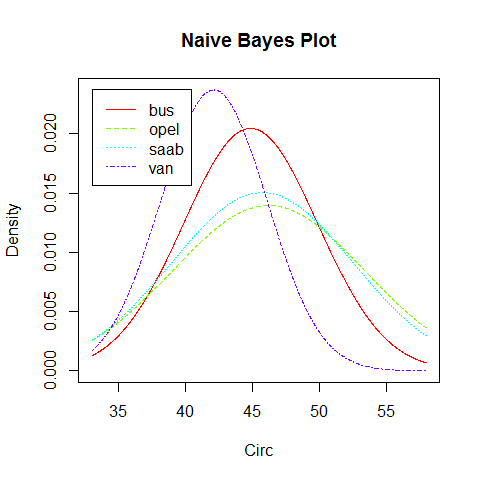<!-- -->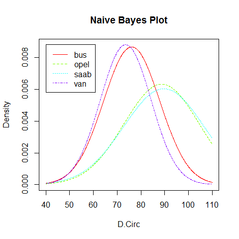<!-- -->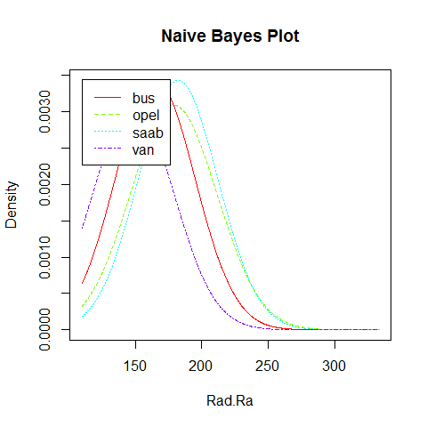<!-- -->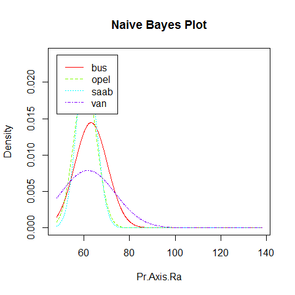<!-- --><!-- --><!-- --><!-- --><!-- -->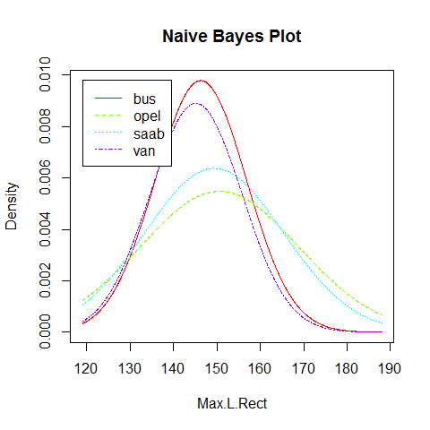<!-- -->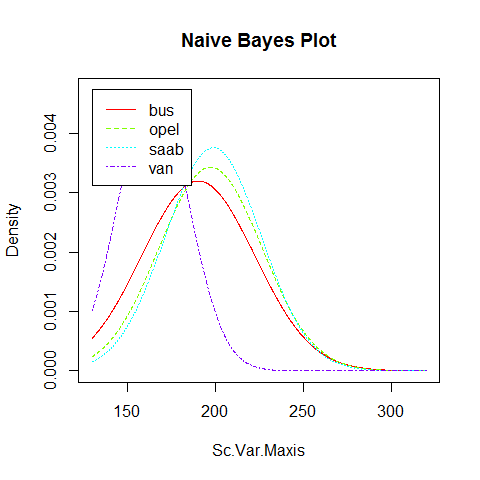<!-- -->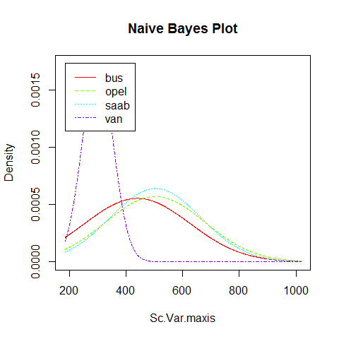<!-- -->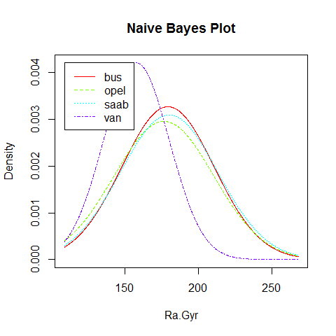<!-- -->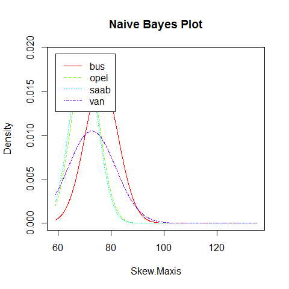<!-- -->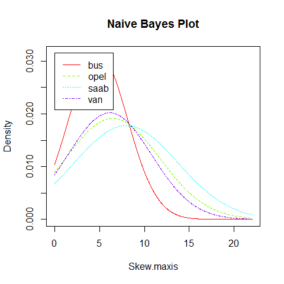<!-- -->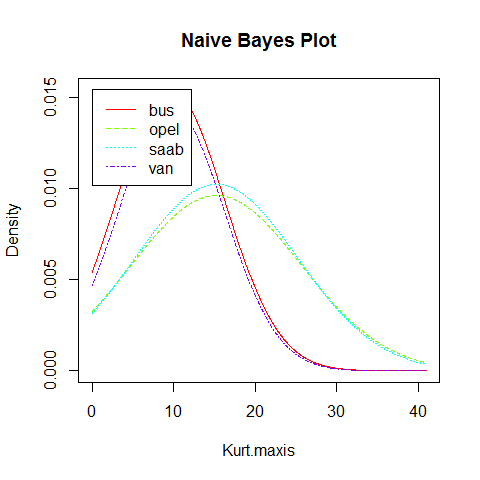<!-- -->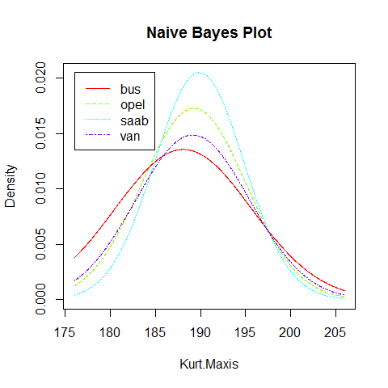<!-- -->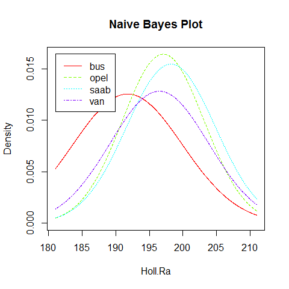<!-- -->

<br>

# KNN - k Nearest Neighbours

We are going to learn about

* Steps for kNN
* Distance matrix
* Normalization
* k-NN for classification
* k-NN for regression
* Implementation in R

## Steps for kNN

kNN is a machine learning algorithm that can predict both categorial and continuous variables. It predicts the value of a record based on the information of it's neighbours. Predicting the class of a data point happens in 5 steps:


## Distance matrix

Distances can be calculated with several measures. Some of them are shown below. Regardless of which one you choose, we need to calculate a matrix of distances which represents, for each record, the distance to all other records.


```r
data("iris")
head(iris)
```

```
##   Sepal.Length Sepal.Width Petal.Length Petal.Width Species
## 1          5.1         3.5          1.4         0.2  setosa
## 2          4.9         3.0          1.4         0.2  setosa
## 3          4.7         3.2          1.3         0.2  setosa
## 4          4.6         3.1          1.5         0.2  setosa
## 5          5.0         3.6          1.4         0.2  setosa
## 6          5.4         3.9          1.7         0.4  setosa
```

### Calculating in R


```r
# Euclidean Distance matrix - the first 10 rows using the values of the first 4 columns
data(iris)
class(iris)
```

```
## [1] "data.frame"
```

```r
d1 = dist(iris[1:10,c(1:4)])
d1
```

```
##            1         2         3         4         5         6         7         8         9
## 2  0.5385165                                                                                
## 3  0.5099020 0.3000000                                                                      
## 4  0.6480741 0.3316625 0.2449490                                                            
## 5  0.1414214 0.6082763 0.5099020 0.6480741                                                  
## 6  0.6164414 1.0908712 1.0862780 1.1661904 0.6164414                                        
## 7  0.5196152 0.5099020 0.2645751 0.3316625 0.4582576 0.9949874                              
## 8  0.1732051 0.4242641 0.4123106 0.5000000 0.2236068 0.7000000 0.4242641                    
## 9  0.9219544 0.5099020 0.4358899 0.3000000 0.9219544 1.4594520 0.5477226 0.7874008          
## 10 0.4690416 0.1732051 0.3162278 0.3162278 0.5291503 1.0099505 0.4795832 0.3316625 0.5567764
```

```r
# As an example of how this is calculated
iris[1:2,]
```

```
##   Sepal.Length Sepal.Width Petal.Length Petal.Width Species
## 1          5.1         3.5          1.4         0.2  setosa
## 2          4.9         3.0          1.4         0.2  setosa
```

```r
sqrt(((5.1-4.9)^2 + (3.5-3.0)^2 + (1.4-1.4)^2 + (0.2-0.2)^2))
```

```
## [1] 0.5385165
```

We can answer this question with the distance matrix. As an example, for the first record we see that record 5 and 8 are quite close compared to the other records. 

So, taking it back to one of the steps in kNN:

* Remember we specify k. Let's say k = 3.
* The classification output for the first record will be the majority or average class of the 3 nearest records.

## Normalization

It is important to normalize before taking any further action. This is because, if we have variables that have different orders of magnitude, they will skew the end classification. We need to bring them to an equivalent order. There are many ways to normalise record, but let's add a simple way of doing so, which is to chane the range so that all features are between 0 and 1.


```r
normalize = function(x){return((x-min(x))/(max(x)-min(x)))}

normalized_iris = lapply(iris[,-5], normalize)
iris_n = data.frame(normalized_iris, Species = iris[,5])
summary(iris_n)
```

```
##   Sepal.Length     Sepal.Width      Petal.Length     Petal.Width            Species  
##  Min.   :0.0000   Min.   :0.0000   Min.   :0.0000   Min.   :0.00000   setosa    :50  
##  1st Qu.:0.2222   1st Qu.:0.3333   1st Qu.:0.1017   1st Qu.:0.08333   versicolor:50  
##  Median :0.4167   Median :0.4167   Median :0.5678   Median :0.50000   virginica :50  
##  Mean   :0.4287   Mean   :0.4406   Mean   :0.4675   Mean   :0.45806                  
##  3rd Qu.:0.5833   3rd Qu.:0.5417   3rd Qu.:0.6949   3rd Qu.:0.70833                  
##  Max.   :1.0000   Max.   :1.0000   Max.   :1.0000   Max.   :1.00000
```

### Recalculating distances after normalization

As you can see, the neighbours have now changed. This is why normalization is so important! We don't want variables that have a higher magnitude have a higher impact just because of so. We want them to be important regardless of their order of magnitude.


```r
d2 = dist(iris_n[1:10,c(1:4)])
d2
```

```
##             1          2          3          4          5          6          7          8          9
## 2  0.21561354                                                                                        
## 3  0.16810102 0.10157824                                                                             
## 4  0.21761244 0.09469862 0.06047157                                                                  
## 5  0.05007710 0.25153848 0.18710825 0.23671867                                                       
## 6  0.21036190 0.41163701 0.36663185 0.41059392 0.19365068                                            
## 7  0.15087195 0.19094065 0.09868857 0.13284722 0.14500426 0.31162007                                 
## 8  0.05286766 0.16981359 0.12262946 0.16724437 0.08503951 0.25266974 0.11987103                      
## 9  0.31671540 0.14500426 0.15118438 0.10157824 0.33592741 0.51019752 0.21960262 0.26733468           
## 10 0.18134934 0.06131473 0.08779372 0.09316950 0.21493666 0.38363437 0.17263013 0.13465777 0.16810102
```

## kNN for classification


```r
# Split the data
set.seed(100)
train_rows = createDataPartition(iris_n$Species, p = 0.7, list = F)
train = iris_n[train_rows, ]
test = iris_n[-train_rows, ]

# Build the model
fit = caret::knn3(train[, -5], train[, 5], k = 5)

# Make predictions
predictions = predict(fit, test[, -5], type = "class")
tab = table(predictions, test$Species)
caret::confusionMatrix(tab)
```

```
## Confusion Matrix and Statistics
## 
##             
## predictions  setosa versicolor virginica
##   setosa         15          0         0
##   versicolor      0         13         0
##   virginica       0          2        15
## 
## Overall Statistics
##                                                
##                Accuracy : 0.9556               
##                  95% CI : (0.8485, 0.9946)     
##     No Information Rate : 0.3333               
##     P-Value [Acc > NIR] : < 0.00000000000000022
##                                                
##                   Kappa : 0.9333               
##  Mcnemar's Test P-Value : NA                   
## 
## Statistics by Class:
## 
##                      Class: setosa Class: versicolor Class: virginica
## Sensitivity                 1.0000            0.8667           1.0000
## Specificity                 1.0000            1.0000           0.9333
## Pos Pred Value              1.0000            1.0000           0.8824
## Neg Pred Value              1.0000            0.9375           1.0000
## Prevalence                  0.3333            0.3333           0.3333
## Detection Rate              0.3333            0.2889           0.3333
## Detection Prevalence        0.3333            0.2889           0.3778
## Balanced Accuracy           1.0000            0.9333           0.9667
```

## kNN for continuous variables


```r
# Get the data
data(Boston, package = "MASS")
head(Boston)
```

```
##      crim zn indus chas   nox    rm  age    dis rad tax ptratio  black lstat medv
## 1 0.00632 18  2.31    0 0.538 6.575 65.2 4.0900   1 296    15.3 396.90  4.98 24.0
## 2 0.02731  0  7.07    0 0.469 6.421 78.9 4.9671   2 242    17.8 396.90  9.14 21.6
## 3 0.02729  0  7.07    0 0.469 7.185 61.1 4.9671   2 242    17.8 392.83  4.03 34.7
## 4 0.03237  0  2.18    0 0.458 6.998 45.8 6.0622   3 222    18.7 394.63  2.94 33.4
## 5 0.06905  0  2.18    0 0.458 7.147 54.2 6.0622   3 222    18.7 396.90  5.33 36.2
## 6 0.02985  0  2.18    0 0.458 6.430 58.7 6.0622   3 222    18.7 394.12  5.21 28.7
```

```r
# Split the data
set.seed(100)
train_rows = createDataPartition(Boston$medv, p = 0.7, list = F)
train = Boston[train_rows, ]
test = Boston[-train_rows, ]

# Build the model
fit = caret::knnreg(train[, -14], train[, 14], k = 5)

# Make predictions
predictions = predict(fit, test[, -5], type = "class")
DMwR::regr.eval(test$medv, predictions)
```

```
##         mae         mse        rmse        mape 
##   7.5913556 108.1100294  10.3975973   0.3187053
```


<br>

# Building tree based models using rpart, cTree and C5.0

In this section we will understand:

* How decision trees work

* Tree structure
* Information gain, entropy, gini index, classification error
* Why is it called a greedy algorithm

* Algorithms and Implementations

* rpart(CART)
* cTree
* C5.0

## How do decision trees work? - cTree example


```r
library(caret)

# Splitting data
train_rows = createDataPartition(iris$Species, p = 0.7, list = F)
trainData = iris[train_rows, ]
testData = iris[-train_rows, ]

# partykit library for cTree algorithm
library(partykit)

ctMod = ctree(Species ~ Sepal.Length + Sepal.Width + Petal.Length + Petal.Width, data = trainData)
print(ctMod)
```

```
## 
## 	 Conditional inference tree with 4 terminal nodes
## 
## Response:  Species 
## Inputs:  Sepal.Length, Sepal.Width, Petal.Length, Petal.Width 
## Number of observations:  105 
## 
## 1) Petal.Length <= 1.9; criterion = 1, statistic = 98.062
##   2)*  weights = 35 
## 1) Petal.Length > 1.9
##   3) Petal.Width <= 1.7; criterion = 1, statistic = 48.405
##     4) Petal.Length <= 4.6; criterion = 0.975, statistic = 7.425
##       5)*  weights = 29 
##     4) Petal.Length > 4.6
##       6)*  weights = 8 
##   3) Petal.Width > 1.7
##     7)*  weights = 33
```

```r
plot(ctMod)
```

<!-- -->

This is a classification tree. 

* It is a hierarchical structure that aims to classify a categorial response variable by learning how each predictor divides the Y variable. 
* The very top of the tree is the **root node** and the ones at the very end are called the **terminal nodes**. 
* The minimum number of observations required in order to be considered for a split and the number of branches is controlled using parameters of the algorithm
* A 100% pure node will have only one class of Y
* The goal is to make the terminal node as pure as possible while not growing branches that are too deep. 

So how is the tree grown?

* Each node is nothing but a rule based on an x variable. 
* The rules are decided such that the resulting groups are as pure as possible.
* But how is the impurity/purity of groups measured?
* This is calculated via certain metrics, like for example, Entropy or Information gain. 
* Basically, split that provides the most information gain, goes the first.
* This is the reason why decision trees are called greedy algorithms. This is because it is not guaranteed they will return the purest possible terminal nodes,


## cTree algorithm - controlling parameters

We have seen how to implement a cTree algorithm. The cTree algorithms has many parameters feeding into it and we can play around with those parameters using the **ctree_control** function. Let's check this creating another tree.


```r
ctMod_2 = ctree(Species ~ Sepal.Length + Sepal.Width + Petal.Length + Petal.Width
                , control = ctree_control(maxdepth = 2)
                , data = trainData)

print(ctMod_2)
```

```
## 
## 	 Conditional inference tree with 3 terminal nodes
## 
## Response:  Species 
## Inputs:  Sepal.Length, Sepal.Width, Petal.Length, Petal.Width 
## Number of observations:  105 
## 
## 1) Petal.Length <= 1.9; criterion = 1, statistic = 98.062
##   2)*  weights = 35 
## 1) Petal.Length > 1.9
##   3) Petal.Width <= 1.7; criterion = 1, statistic = 48.405
##     4)*  weights = 37 
##   3) Petal.Width > 1.7
##     5)*  weights = 33
```

```r
plot(ctMod_2)
```

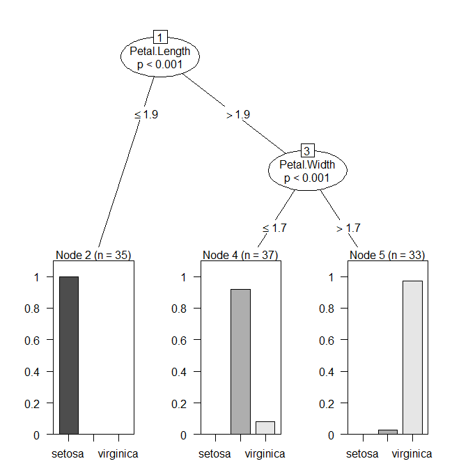<!-- -->

## Predict using the previous 2 models


```r
# Predict 1
out1 = predict(ctMod, testData)

# Predict 2
out2 = predict(ctMod_2, testData)

# How many miss matched predict 1
sum(testData[, 5] != out1)
```

```
## [1] 2
```

```r
# How many miss matched predict 1
sum(testData[, 5] != out2)
```

```
## [1] 2
```

## rpart

### Control parameters


### Implement in R


```r
library(rpart)

# Model
rpartMod = rpart(Species ~ .
                 , data = trainData
                 , control = rpart.control(minsplit = 5
                                           , cp = 0
                                           , maxdepth = 4))
rpartMod
```

```
## n= 105 
## 
## node), split, n, loss, yval, (yprob)
##       * denotes terminal node
## 
##  1) root 105 70 setosa (0.33333333 0.33333333 0.33333333)  
##    2) Petal.Length< 2.6 35  0 setosa (1.00000000 0.00000000 0.00000000) *
##    3) Petal.Length>=2.6 70 35 versicolor (0.00000000 0.50000000 0.50000000)  
##      6) Petal.Width< 1.75 37  3 versicolor (0.00000000 0.91891892 0.08108108)  
##       12) Petal.Length< 5.05 35  1 versicolor (0.00000000 0.97142857 0.02857143) *
##       13) Petal.Length>=5.05 2  0 virginica (0.00000000 0.00000000 1.00000000) *
##      7) Petal.Width>=1.75 33  1 virginica (0.00000000 0.03030303 0.96969697) *
```

```r
# Prediction
pred = predict(rpartMod, testData, type = "class")
sum(testData[, 5] != pred)
```

```
## [1] 2
```

### Fancy rpart tree plotting


```r
library(rattle)

# Option 1 - fancyRpartPlot
fancyRpartPlot(rpartMod)
```

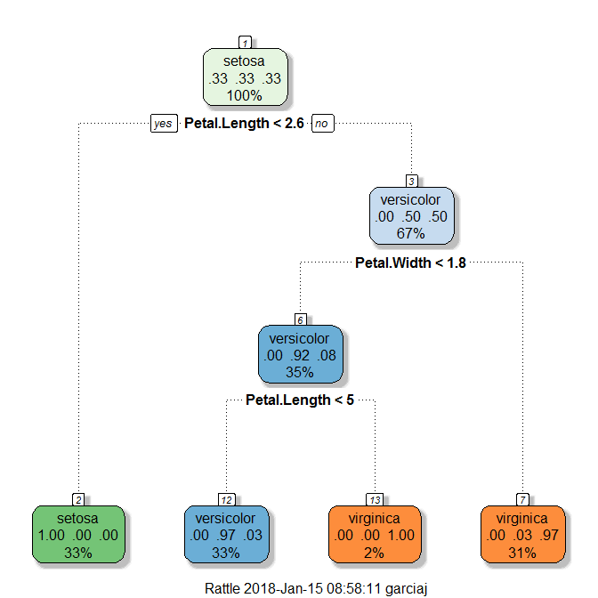<!-- -->

```r
# Option 2 - convert to a partykit object and plot as a cTree plot
iris_party = as.party.rpart(rpartMod)
plot(iris_party)
```

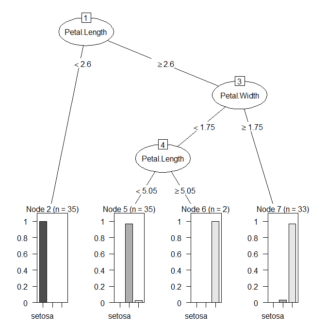<!-- -->

```r
# Option 3 - manually
library(rpart.plot)
prp(rpartMod, extra = 1, type = 2)
```

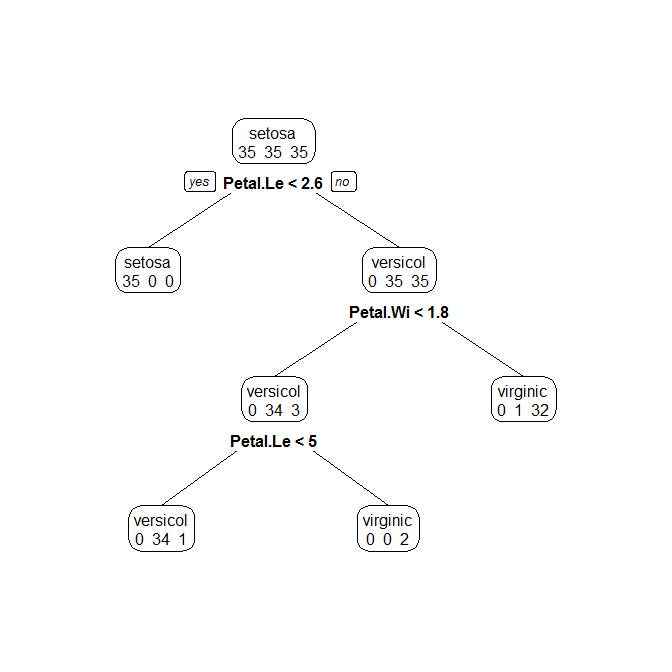<!-- -->

## C5.0 algorithm

The C5.0 algorithm incorporates the boosting algorithm.  

### Tree


```r
library(C50)

c5Mod = C5.0(Species ~ ., data = trainData
             , control = C5.0Control(winnow = F))

summary(c5Mod)
```

```
## 
## Call:
## C5.0.formula(formula = Species ~ ., data = trainData, control = C5.0Control(winnow = F))
## 
## 
## C5.0 [Release 2.07 GPL Edition]  	Mon Jan 15 08:58:12 2018
## -------------------------------
## 
## Class specified by attribute `outcome'
## 
## Read 105 cases (5 attributes) from undefined.data
## 
## Decision tree:
## 
## Petal.Length <= 1.9: setosa (35)
## Petal.Length > 1.9:
## :...Petal.Width > 1.7: virginica (33/1)
##     Petal.Width <= 1.7:
##     :...Petal.Length <= 5: versicolor (35/1)
##         Petal.Length > 5: virginica (2)
## 
## 
## Evaluation on training data (105 cases):
## 
## 	    Decision Tree   
## 	  ----------------  
## 	  Size      Errors  
## 
## 	     4    2( 1.9%)   <<
## 
## 
## 	   (a)   (b)   (c)    <-classified as
## 	  ----  ----  ----
## 	    35                (a): class setosa
## 	          34     1    (b): class versicolor
## 	           1    34    (c): class virginica
## 
## 
## 	Attribute usage:
## 
## 	100.00%	Petal.Length
## 	 66.67%	Petal.Width
## 
## 
## Time: 0.0 secs
```

```r
plot(c5Mod)
```

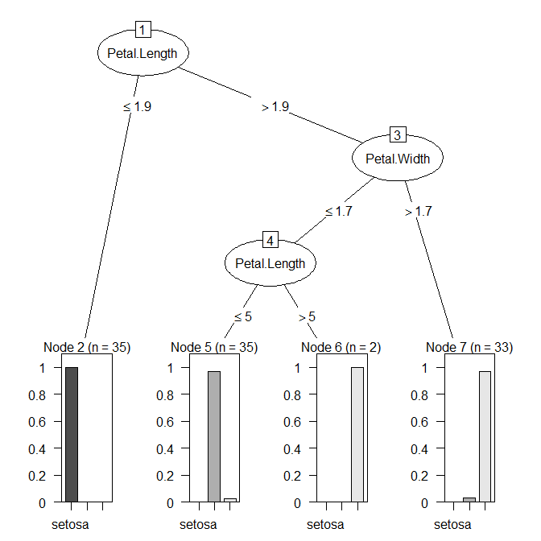<!-- -->

```r
C5imp(c5Mod)
```

```
##              Overall
## Petal.Length  100.00
## Petal.Width    66.67
## Sepal.Length    0.00
## Sepal.Width     0.00
```

### Rules


```r
library(C50)

c5Mod = C5.0(Species ~ ., data = trainData
             , control = C5.0Control(winnow = F)
             , rules = T)

summary(c5Mod)
```

```
## 
## Call:
## C5.0.formula(formula = Species ~ ., data = trainData, control = C5.0Control(winnow = F), rules = T)
## 
## 
## C5.0 [Release 2.07 GPL Edition]  	Mon Jan 15 08:58:12 2018
## -------------------------------
## 
## Class specified by attribute `outcome'
## 
## Read 105 cases (5 attributes) from undefined.data
## 
## Rules:
## 
## Rule 1: (35, lift 2.9)
## 	Petal.Length <= 1.9
## 	->  class setosa  [0.973]
## 
## Rule 2: (35/1, lift 2.8)
## 	Petal.Length > 1.9
## 	Petal.Length <= 5
## 	Petal.Width <= 1.7
## 	->  class versicolor  [0.946]
## 
## Rule 3: (29, lift 2.9)
## 	Petal.Length > 5
## 	->  class virginica  [0.968]
## 
## Rule 4: (33/1, lift 2.8)
## 	Petal.Width > 1.7
## 	->  class virginica  [0.943]
## 
## Default class: setosa
## 
## 
## Evaluation on training data (105 cases):
## 
## 	        Rules     
## 	  ----------------
## 	    No      Errors
## 
## 	     4    2( 1.9%)   <<
## 
## 
## 	   (a)   (b)   (c)    <-classified as
## 	  ----  ----  ----
## 	    35                (a): class setosa
## 	          34     1    (b): class versicolor
## 	           1    34    (c): class virginica
## 
## 
## 	Attribute usage:
## 
## 	 94.29%	Petal.Length
## 	 64.76%	Petal.Width
## 
## 
## Time: 0.0 secs
```

<br>

# Building Predictive Models with the caret Package

Caret will enable you to control, evalute and train the model all within the same package.

## Preprocessing


```r
library(caret)

# Normalze all X's to range from 0 to 1
preprocessParams = preProcess(iris[,1:4], method = c("range"))
preprocessParams
```

```
## Created from 150 samples and 4 variables
## 
## Pre-processing:
##   - ignored (0)
##   - re-scaling to [0, 1] (4)
```

```r
# Apply the transform
normalized = predict(preprocessParams, iris[,1:4])
iris_n = cbind(normalized, Species = iris$Species)
summary(iris_n)
```

```
##   Sepal.Length     Sepal.Width      Petal.Length     Petal.Width            Species  
##  Min.   :0.0000   Min.   :0.0000   Min.   :0.0000   Min.   :0.00000   setosa    :50  
##  1st Qu.:0.2222   1st Qu.:0.3333   1st Qu.:0.1017   1st Qu.:0.08333   versicolor:50  
##  Median :0.4167   Median :0.4167   Median :0.5678   Median :0.50000   virginica :50  
##  Mean   :0.4287   Mean   :0.4406   Mean   :0.4675   Mean   :0.45806                  
##  3rd Qu.:0.5833   3rd Qu.:0.5417   3rd Qu.:0.6949   3rd Qu.:0.70833                  
##  Max.   :1.0000   Max.   :1.0000   Max.   :1.0000   Max.   :1.00000
```

Here is the full list of transformations you can apply using the method parameter in the preprocessParams function in the caret package


## Training and predicting with knn using caret package

The most powerful feature in the caret package is the train function. If you go to the following web page, you will see the full list of predictive models that the caret package can handle.

**http://topepo.github.io/caret/available-models.html**


```r
set.seed(100)
train_rows = createDataPartition(iris_n$Species, p = 0.7, list = F)
trainData = iris_n[train_rows, ]
testData = iris_n[-train_rows, ]
fit = train(Species ~ ., data = trainData, preProcess = c("range"), method = "knn")
fit
```

```
## k-Nearest Neighbors 
## 
## 105 samples
##   4 predictor
##   3 classes: 'setosa', 'versicolor', 'virginica' 
## 
## Pre-processing: re-scaling to [0, 1] (4) 
## Resampling: Bootstrapped (25 reps) 
## Summary of sample sizes: 105, 105, 105, 105, 105, 105, ... 
## Resampling results across tuning parameters:
## 
##   k  Accuracy   Kappa    
##   5  0.9416307  0.9108015
##   7  0.9443025  0.9151724
##   9  0.9466442  0.9187246
## 
## Accuracy was used to select the optimal model using  the largest value.
## The final value used for the model was k = 9.
```

Check that we can perform multiple steps within the train function in caret: both the preProcess step and the method chosen to train the data. The results show:

* Preprocessing was a rescaling to the range of 0 to 1, for 4 features
* Resampling means that the algorithm was run on the train data 25 times by resampling.
* Then for different values of the k parameter, we see the accuracy and kappa metrics.


```r
# predict using the final model in the fit object
pred = predict(fit$finalModel, newdata = testData[,1:4], type="class")
```

## Controlling training method parameters caret package

We can do this by using the trainControl function that can be used as an input to the train function.

### Creating the trainControl object and passing to a model

```r
tc = trainControl(method = "repeatedcv", number = 5, repeats = 3)

fit_repeatedcv = train(Species ~ ., data = trainData, 
                       preProcess = c("range")
                       , method = "knn"
                       , trControl = tc)

fit_repeatedcv
```

```
## k-Nearest Neighbors 
## 
## 105 samples
##   4 predictor
##   3 classes: 'setosa', 'versicolor', 'virginica' 
## 
## Pre-processing: re-scaling to [0, 1] (4) 
## Resampling: Cross-Validated (5 fold, repeated 3 times) 
## Summary of sample sizes: 84, 84, 84, 84, 84, 84, ... 
## Resampling results across tuning parameters:
## 
##   k  Accuracy   Kappa    
##   5  0.9587302  0.9380952
##   7  0.9587302  0.9380952
##   9  0.9523810  0.9285714
## 
## Accuracy was used to select the optimal model using  the largest value.
## The final value used for the model was k = 5.
```

### Changing the evaluation metric

```r
# We can also change the evaluation metric that the method will use to check the best model
fit_repeatedcv_kappa = train(Species ~ ., data = trainData, 
                       preProcess = c("range")
                       , method = "knn"
                       , trControl = tc
                       , metric= "Kappa")

fit_repeatedcv_kappa
```

```
## k-Nearest Neighbors 
## 
## 105 samples
##   4 predictor
##   3 classes: 'setosa', 'versicolor', 'virginica' 
## 
## Pre-processing: re-scaling to [0, 1] (4) 
## Resampling: Cross-Validated (5 fold, repeated 3 times) 
## Summary of sample sizes: 84, 84, 84, 84, 84, 84, ... 
## Resampling results across tuning parameters:
## 
##   k  Accuracy   Kappa    
##   5  0.9587302  0.9380952
##   7  0.9428571  0.9142857
##   9  0.9460317  0.9190476
## 
## Kappa was used to select the optimal model using  the largest value.
## The final value used for the model was k = 5.
```

### Adding more metric information to the output

```r
# Add to the control parameters a summary function
tc = trainControl(method = "repeatedcv", number = 5, repeats = 3
                  , summaryFunction = multiClassSummary)


# We can also change the evaluation metric that the method will use to check the best model
fit_repeatedcv_kappa = train(Species ~ ., data = trainData, 
                       preProcess = c("range")
                       , method = "knn"
                       , trControl = tc
                       , metric= "Kappa")

fit_repeatedcv_kappa
```

```
## k-Nearest Neighbors 
## 
## 105 samples
##   4 predictor
##   3 classes: 'setosa', 'versicolor', 'virginica' 
## 
## Pre-processing: re-scaling to [0, 1] (4) 
## Resampling: Cross-Validated (5 fold, repeated 3 times) 
## Summary of sample sizes: 84, 84, 84, 84, 84, 84, ... 
## Resampling results across tuning parameters:
## 
##   k  Accuracy   Kappa      Mean_F1    Mean_Sensitivity  Mean_Specificity  Mean_Pos_Pred_Value  Mean_Neg_Pred_Value  Mean_Detection_Rate  Mean_Balanced_Accuracy
##   5  0.9587302  0.9380952  0.9585165  0.9587302         0.9793651         0.9621252            0.9802910            0.3195767            0.9690476             
##   7  0.9619048  0.9428571  0.9617074  0.9619048         0.9809524         0.9649030            0.9817725            0.3206349            0.9714286             
##   9  0.9523810  0.9285714  0.9521673  0.9523810         0.9761905         0.9557760            0.9771164            0.3174603            0.9642857             
## 
## Kappa was used to select the optimal model using  the largest value.
## The final value used for the model was k = 7.
```

## Controlling the tuning of the algorithms parameters

As you know, there are multiple training algorithms we can use to train a model. Sometimes, some of these models have many possible input parameters that we can change, so a very helpful function is the modelLookup, that will output the list of parameters you can use (or alternatively, you can use the webpage above).


```r
# As you can see, knn as only 1 input parameter to change
modelLookup("knn")
```

```
##   model parameter      label forReg forClass probModel
## 1   knn         k #Neighbors   TRUE     TRUE      TRUE
```

### Defining grid search


```r
# Create the grid for knn
grid = expand.grid(k = c(5,7,11,13,17,19,23,25))

fit_repeatedcv_kappa_tunegrid = train(Species ~ .,
                                      data = trainData
                                      , preProcess = c("range")
                                      , method = "knn"
                                      , trControl = tc
                                      , metric = "Kappa"
                                      , tuneGrid = grid)


fit_repeatedcv_kappa_tunegrid
```

```
## k-Nearest Neighbors 
## 
## 105 samples
##   4 predictor
##   3 classes: 'setosa', 'versicolor', 'virginica' 
## 
## Pre-processing: re-scaling to [0, 1] (4) 
## Resampling: Cross-Validated (5 fold, repeated 3 times) 
## Summary of sample sizes: 84, 84, 84, 84, 84, 84, ... 
## Resampling results across tuning parameters:
## 
##   k   Accuracy   Kappa      Mean_F1    Mean_Sensitivity  Mean_Specificity  Mean_Pos_Pred_Value  Mean_Neg_Pred_Value  Mean_Detection_Rate  Mean_Balanced_Accuracy
##    5  0.9587302  0.9380952  0.9583842  0.9587302         0.9793651         0.9635362            0.9806878            0.3195767            0.9690476             
##    7  0.9587302  0.9380952  0.9583516  0.9587302         0.9793651         0.9643298            0.9808995            0.3195767            0.9690476             
##   11  0.9555556  0.9333333  0.9551608  0.9555556         0.9777778         0.9615520            0.9794180            0.3185185            0.9666667             
##   13  0.9492063  0.9238095  0.9486793  0.9492063         0.9746032         0.9566138            0.9766402            0.3164021            0.9619048             
##   17  0.9492063  0.9238095  0.9485470  0.9492063         0.9746032         0.9580247            0.9770370            0.3164021            0.9619048             
##   19  0.9555556  0.9333333  0.9550285  0.9555556         0.9777778         0.9629630            0.9798148            0.3185185            0.9666667             
##   23  0.9523810  0.9285714  0.9519699  0.9523810         0.9761905         0.9578483            0.9777086            0.3174603            0.9642857             
##   25  0.9428571  0.9142857  0.9419984  0.9428571         0.9714286         0.9529101            0.9742328            0.3142857            0.9571429             
## 
## Kappa was used to select the optimal model using  the largest value.
## The final value used for the model was k = 7.
```

```r
fit_repeatedcv_kappa_tunegrid$finalModel
```

```
## 7-nearest neighbor classification model
## Training set class distribution:
## 
##     setosa versicolor  virginica 
##         35         35         35
```

## C5 algorithm with caret


```r
# Create the grid for knn
c5_fit_repeatedcv_kappa = train(Species ~ .
                                , data = trainData
                                , preProcess = c("range")
                                , method = "C5.0"
                                , trControl = tc
                                , metric = "Kappa"
                                , tuneLength = 10)
```

```
## Warning: 'trials' should be <= 31 for this object. Predictions generated using 31 trials

## Warning: 'trials' should be <= 31 for this object. Predictions generated using 31 trials

## Warning: 'trials' should be <= 31 for this object. Predictions generated using 31 trials

## Warning: 'trials' should be <= 31 for this object. Predictions generated using 31 trials

## Warning: 'trials' should be <= 31 for this object. Predictions generated using 31 trials
```

```
## Warning: 'trials' should be <= 8 for this object. Predictions generated using 8 trials

## Warning: 'trials' should be <= 8 for this object. Predictions generated using 8 trials

## Warning: 'trials' should be <= 8 for this object. Predictions generated using 8 trials

## Warning: 'trials' should be <= 8 for this object. Predictions generated using 8 trials

## Warning: 'trials' should be <= 8 for this object. Predictions generated using 8 trials

## Warning: 'trials' should be <= 8 for this object. Predictions generated using 8 trials

## Warning: 'trials' should be <= 8 for this object. Predictions generated using 8 trials

## Warning: 'trials' should be <= 8 for this object. Predictions generated using 8 trials
```

```
## Warning: 'trials' should be <= 31 for this object. Predictions generated using 31 trials

## Warning: 'trials' should be <= 31 for this object. Predictions generated using 31 trials

## Warning: 'trials' should be <= 31 for this object. Predictions generated using 31 trials

## Warning: 'trials' should be <= 31 for this object. Predictions generated using 31 trials

## Warning: 'trials' should be <= 31 for this object. Predictions generated using 31 trials
```

```
## Warning: 'trials' should be <= 8 for this object. Predictions generated using 8 trials

## Warning: 'trials' should be <= 8 for this object. Predictions generated using 8 trials

## Warning: 'trials' should be <= 8 for this object. Predictions generated using 8 trials

## Warning: 'trials' should be <= 8 for this object. Predictions generated using 8 trials

## Warning: 'trials' should be <= 8 for this object. Predictions generated using 8 trials

## Warning: 'trials' should be <= 8 for this object. Predictions generated using 8 trials

## Warning: 'trials' should be <= 8 for this object. Predictions generated using 8 trials

## Warning: 'trials' should be <= 8 for this object. Predictions generated using 8 trials
```

```
## Warning: 'trials' should be <= 4 for this object. Predictions generated using 4 trials

## Warning: 'trials' should be <= 4 for this object. Predictions generated using 4 trials

## Warning: 'trials' should be <= 4 for this object. Predictions generated using 4 trials

## Warning: 'trials' should be <= 4 for this object. Predictions generated using 4 trials

## Warning: 'trials' should be <= 4 for this object. Predictions generated using 4 trials

## Warning: 'trials' should be <= 4 for this object. Predictions generated using 4 trials

## Warning: 'trials' should be <= 4 for this object. Predictions generated using 4 trials

## Warning: 'trials' should be <= 4 for this object. Predictions generated using 4 trials

## Warning: 'trials' should be <= 4 for this object. Predictions generated using 4 trials

## Warning: 'trials' should be <= 4 for this object. Predictions generated using 4 trials

## Warning: 'trials' should be <= 4 for this object. Predictions generated using 4 trials

## Warning: 'trials' should be <= 4 for this object. Predictions generated using 4 trials

## Warning: 'trials' should be <= 4 for this object. Predictions generated using 4 trials

## Warning: 'trials' should be <= 4 for this object. Predictions generated using 4 trials

## Warning: 'trials' should be <= 4 for this object. Predictions generated using 4 trials

## Warning: 'trials' should be <= 4 for this object. Predictions generated using 4 trials

## Warning: 'trials' should be <= 4 for this object. Predictions generated using 4 trials

## Warning: 'trials' should be <= 4 for this object. Predictions generated using 4 trials

## Warning: 'trials' should be <= 4 for this object. Predictions generated using 4 trials

## Warning: 'trials' should be <= 4 for this object. Predictions generated using 4 trials

## Warning: 'trials' should be <= 4 for this object. Predictions generated using 4 trials

## Warning: 'trials' should be <= 4 for this object. Predictions generated using 4 trials

## Warning: 'trials' should be <= 4 for this object. Predictions generated using 4 trials

## Warning: 'trials' should be <= 4 for this object. Predictions generated using 4 trials

## Warning: 'trials' should be <= 4 for this object. Predictions generated using 4 trials

## Warning: 'trials' should be <= 4 for this object. Predictions generated using 4 trials

## Warning: 'trials' should be <= 4 for this object. Predictions generated using 4 trials

## Warning: 'trials' should be <= 4 for this object. Predictions generated using 4 trials

## Warning: 'trials' should be <= 4 for this object. Predictions generated using 4 trials

## Warning: 'trials' should be <= 4 for this object. Predictions generated using 4 trials

## Warning: 'trials' should be <= 4 for this object. Predictions generated using 4 trials

## Warning: 'trials' should be <= 4 for this object. Predictions generated using 4 trials

## Warning: 'trials' should be <= 4 for this object. Predictions generated using 4 trials

## Warning: 'trials' should be <= 4 for this object. Predictions generated using 4 trials

## Warning: 'trials' should be <= 4 for this object. Predictions generated using 4 trials

## Warning: 'trials' should be <= 4 for this object. Predictions generated using 4 trials

## Warning: 'trials' should be <= 4 for this object. Predictions generated using 4 trials

## Warning: 'trials' should be <= 4 for this object. Predictions generated using 4 trials

## Warning: 'trials' should be <= 4 for this object. Predictions generated using 4 trials

## Warning: 'trials' should be <= 4 for this object. Predictions generated using 4 trials

## Warning: 'trials' should be <= 4 for this object. Predictions generated using 4 trials

## Warning: 'trials' should be <= 4 for this object. Predictions generated using 4 trials

## Warning: 'trials' should be <= 4 for this object. Predictions generated using 4 trials

## Warning: 'trials' should be <= 4 for this object. Predictions generated using 4 trials

## Warning: 'trials' should be <= 4 for this object. Predictions generated using 4 trials

## Warning: 'trials' should be <= 4 for this object. Predictions generated using 4 trials

## Warning: 'trials' should be <= 4 for this object. Predictions generated using 4 trials

## Warning: 'trials' should be <= 4 for this object. Predictions generated using 4 trials

## Warning: 'trials' should be <= 4 for this object. Predictions generated using 4 trials

## Warning: 'trials' should be <= 4 for this object. Predictions generated using 4 trials

## Warning: 'trials' should be <= 4 for this object. Predictions generated using 4 trials

## Warning: 'trials' should be <= 4 for this object. Predictions generated using 4 trials

## Warning: 'trials' should be <= 4 for this object. Predictions generated using 4 trials

## Warning: 'trials' should be <= 4 for this object. Predictions generated using 4 trials

## Warning: 'trials' should be <= 4 for this object. Predictions generated using 4 trials

## Warning: 'trials' should be <= 4 for this object. Predictions generated using 4 trials

## Warning: 'trials' should be <= 4 for this object. Predictions generated using 4 trials

## Warning: 'trials' should be <= 4 for this object. Predictions generated using 4 trials

## Warning: 'trials' should be <= 4 for this object. Predictions generated using 4 trials

## Warning: 'trials' should be <= 4 for this object. Predictions generated using 4 trials

## Warning: 'trials' should be <= 4 for this object. Predictions generated using 4 trials

## Warning: 'trials' should be <= 4 for this object. Predictions generated using 4 trials

## Warning: 'trials' should be <= 4 for this object. Predictions generated using 4 trials

## Warning: 'trials' should be <= 4 for this object. Predictions generated using 4 trials
```

```
## Warning: 'trials' should be <= 6 for this object. Predictions generated using 6 trials

## Warning: 'trials' should be <= 6 for this object. Predictions generated using 6 trials

## Warning: 'trials' should be <= 6 for this object. Predictions generated using 6 trials

## Warning: 'trials' should be <= 6 for this object. Predictions generated using 6 trials

## Warning: 'trials' should be <= 6 for this object. Predictions generated using 6 trials

## Warning: 'trials' should be <= 6 for this object. Predictions generated using 6 trials

## Warning: 'trials' should be <= 6 for this object. Predictions generated using 6 trials

## Warning: 'trials' should be <= 6 for this object. Predictions generated using 6 trials

## Warning: 'trials' should be <= 6 for this object. Predictions generated using 6 trials

## Warning: 'trials' should be <= 6 for this object. Predictions generated using 6 trials

## Warning: 'trials' should be <= 6 for this object. Predictions generated using 6 trials

## Warning: 'trials' should be <= 6 for this object. Predictions generated using 6 trials

## Warning: 'trials' should be <= 6 for this object. Predictions generated using 6 trials

## Warning: 'trials' should be <= 6 for this object. Predictions generated using 6 trials

## Warning: 'trials' should be <= 6 for this object. Predictions generated using 6 trials

## Warning: 'trials' should be <= 6 for this object. Predictions generated using 6 trials

## Warning: 'trials' should be <= 6 for this object. Predictions generated using 6 trials

## Warning: 'trials' should be <= 6 for this object. Predictions generated using 6 trials

## Warning: 'trials' should be <= 6 for this object. Predictions generated using 6 trials

## Warning: 'trials' should be <= 6 for this object. Predictions generated using 6 trials

## Warning: 'trials' should be <= 6 for this object. Predictions generated using 6 trials

## Warning: 'trials' should be <= 6 for this object. Predictions generated using 6 trials

## Warning: 'trials' should be <= 6 for this object. Predictions generated using 6 trials

## Warning: 'trials' should be <= 6 for this object. Predictions generated using 6 trials
```

```
## Warning: 'trials' should be <= 32 for this object. Predictions generated using 32 trials

## Warning: 'trials' should be <= 32 for this object. Predictions generated using 32 trials

## Warning: 'trials' should be <= 32 for this object. Predictions generated using 32 trials

## Warning: 'trials' should be <= 32 for this object. Predictions generated using 32 trials

## Warning: 'trials' should be <= 32 for this object. Predictions generated using 32 trials
```

```
## Warning: 'trials' should be <= 6 for this object. Predictions generated using 6 trials

## Warning: 'trials' should be <= 6 for this object. Predictions generated using 6 trials

## Warning: 'trials' should be <= 6 for this object. Predictions generated using 6 trials

## Warning: 'trials' should be <= 6 for this object. Predictions generated using 6 trials

## Warning: 'trials' should be <= 6 for this object. Predictions generated using 6 trials

## Warning: 'trials' should be <= 6 for this object. Predictions generated using 6 trials

## Warning: 'trials' should be <= 6 for this object. Predictions generated using 6 trials

## Warning: 'trials' should be <= 6 for this object. Predictions generated using 6 trials
```

```
## Warning: 'trials' should be <= 32 for this object. Predictions generated using 32 trials

## Warning: 'trials' should be <= 32 for this object. Predictions generated using 32 trials

## Warning: 'trials' should be <= 32 for this object. Predictions generated using 32 trials

## Warning: 'trials' should be <= 32 for this object. Predictions generated using 32 trials

## Warning: 'trials' should be <= 32 for this object. Predictions generated using 32 trials
```

```
## Warning: 'trials' should be <= 6 for this object. Predictions generated using 6 trials

## Warning: 'trials' should be <= 6 for this object. Predictions generated using 6 trials

## Warning: 'trials' should be <= 6 for this object. Predictions generated using 6 trials

## Warning: 'trials' should be <= 6 for this object. Predictions generated using 6 trials

## Warning: 'trials' should be <= 6 for this object. Predictions generated using 6 trials

## Warning: 'trials' should be <= 6 for this object. Predictions generated using 6 trials

## Warning: 'trials' should be <= 6 for this object. Predictions generated using 6 trials

## Warning: 'trials' should be <= 6 for this object. Predictions generated using 6 trials
```

```
## Warning: 'trials' should be <= 5 for this object. Predictions generated using 5 trials

## Warning: 'trials' should be <= 5 for this object. Predictions generated using 5 trials

## Warning: 'trials' should be <= 5 for this object. Predictions generated using 5 trials

## Warning: 'trials' should be <= 5 for this object. Predictions generated using 5 trials

## Warning: 'trials' should be <= 5 for this object. Predictions generated using 5 trials

## Warning: 'trials' should be <= 5 for this object. Predictions generated using 5 trials

## Warning: 'trials' should be <= 5 for this object. Predictions generated using 5 trials

## Warning: 'trials' should be <= 5 for this object. Predictions generated using 5 trials
```

```
## Warning: 'trials' should be <= 6 for this object. Predictions generated using 6 trials

## Warning: 'trials' should be <= 6 for this object. Predictions generated using 6 trials

## Warning: 'trials' should be <= 6 for this object. Predictions generated using 6 trials

## Warning: 'trials' should be <= 6 for this object. Predictions generated using 6 trials

## Warning: 'trials' should be <= 6 for this object. Predictions generated using 6 trials

## Warning: 'trials' should be <= 6 for this object. Predictions generated using 6 trials

## Warning: 'trials' should be <= 6 for this object. Predictions generated using 6 trials

## Warning: 'trials' should be <= 6 for this object. Predictions generated using 6 trials
```

```
## Warning: 'trials' should be <= 5 for this object. Predictions generated using 5 trials

## Warning: 'trials' should be <= 5 for this object. Predictions generated using 5 trials

## Warning: 'trials' should be <= 5 for this object. Predictions generated using 5 trials

## Warning: 'trials' should be <= 5 for this object. Predictions generated using 5 trials

## Warning: 'trials' should be <= 5 for this object. Predictions generated using 5 trials

## Warning: 'trials' should be <= 5 for this object. Predictions generated using 5 trials

## Warning: 'trials' should be <= 5 for this object. Predictions generated using 5 trials

## Warning: 'trials' should be <= 5 for this object. Predictions generated using 5 trials

## Warning: 'trials' should be <= 5 for this object. Predictions generated using 5 trials

## Warning: 'trials' should be <= 5 for this object. Predictions generated using 5 trials

## Warning: 'trials' should be <= 5 for this object. Predictions generated using 5 trials

## Warning: 'trials' should be <= 5 for this object. Predictions generated using 5 trials

## Warning: 'trials' should be <= 5 for this object. Predictions generated using 5 trials

## Warning: 'trials' should be <= 5 for this object. Predictions generated using 5 trials

## Warning: 'trials' should be <= 5 for this object. Predictions generated using 5 trials

## Warning: 'trials' should be <= 5 for this object. Predictions generated using 5 trials
```

```
## Warning: 'trials' should be <= 20 for this object. Predictions generated using 20 trials

## Warning: 'trials' should be <= 20 for this object. Predictions generated using 20 trials

## Warning: 'trials' should be <= 20 for this object. Predictions generated using 20 trials

## Warning: 'trials' should be <= 20 for this object. Predictions generated using 20 trials

## Warning: 'trials' should be <= 20 for this object. Predictions generated using 20 trials

## Warning: 'trials' should be <= 20 for this object. Predictions generated using 20 trials
```

```
## Warning: 'trials' should be <= 5 for this object. Predictions generated using 5 trials

## Warning: 'trials' should be <= 5 for this object. Predictions generated using 5 trials

## Warning: 'trials' should be <= 5 for this object. Predictions generated using 5 trials

## Warning: 'trials' should be <= 5 for this object. Predictions generated using 5 trials

## Warning: 'trials' should be <= 5 for this object. Predictions generated using 5 trials

## Warning: 'trials' should be <= 5 for this object. Predictions generated using 5 trials

## Warning: 'trials' should be <= 5 for this object. Predictions generated using 5 trials

## Warning: 'trials' should be <= 5 for this object. Predictions generated using 5 trials
```

```
## Warning: 'trials' should be <= 20 for this object. Predictions generated using 20 trials

## Warning: 'trials' should be <= 20 for this object. Predictions generated using 20 trials

## Warning: 'trials' should be <= 20 for this object. Predictions generated using 20 trials

## Warning: 'trials' should be <= 20 for this object. Predictions generated using 20 trials

## Warning: 'trials' should be <= 20 for this object. Predictions generated using 20 trials

## Warning: 'trials' should be <= 20 for this object. Predictions generated using 20 trials
```

```
## Warning: 'trials' should be <= 3 for this object. Predictions generated using 3 trials

## Warning: 'trials' should be <= 3 for this object. Predictions generated using 3 trials

## Warning: 'trials' should be <= 3 for this object. Predictions generated using 3 trials

## Warning: 'trials' should be <= 3 for this object. Predictions generated using 3 trials

## Warning: 'trials' should be <= 3 for this object. Predictions generated using 3 trials

## Warning: 'trials' should be <= 3 for this object. Predictions generated using 3 trials

## Warning: 'trials' should be <= 3 for this object. Predictions generated using 3 trials

## Warning: 'trials' should be <= 3 for this object. Predictions generated using 3 trials

## Warning: 'trials' should be <= 3 for this object. Predictions generated using 3 trials

## Warning: 'trials' should be <= 3 for this object. Predictions generated using 3 trials

## Warning: 'trials' should be <= 3 for this object. Predictions generated using 3 trials

## Warning: 'trials' should be <= 3 for this object. Predictions generated using 3 trials

## Warning: 'trials' should be <= 3 for this object. Predictions generated using 3 trials

## Warning: 'trials' should be <= 3 for this object. Predictions generated using 3 trials

## Warning: 'trials' should be <= 3 for this object. Predictions generated using 3 trials

## Warning: 'trials' should be <= 3 for this object. Predictions generated using 3 trials

## Warning: 'trials' should be <= 3 for this object. Predictions generated using 3 trials

## Warning: 'trials' should be <= 3 for this object. Predictions generated using 3 trials

## Warning: 'trials' should be <= 3 for this object. Predictions generated using 3 trials

## Warning: 'trials' should be <= 3 for this object. Predictions generated using 3 trials

## Warning: 'trials' should be <= 3 for this object. Predictions generated using 3 trials

## Warning: 'trials' should be <= 3 for this object. Predictions generated using 3 trials

## Warning: 'trials' should be <= 3 for this object. Predictions generated using 3 trials

## Warning: 'trials' should be <= 3 for this object. Predictions generated using 3 trials

## Warning: 'trials' should be <= 3 for this object. Predictions generated using 3 trials

## Warning: 'trials' should be <= 3 for this object. Predictions generated using 3 trials

## Warning: 'trials' should be <= 3 for this object. Predictions generated using 3 trials

## Warning: 'trials' should be <= 3 for this object. Predictions generated using 3 trials

## Warning: 'trials' should be <= 3 for this object. Predictions generated using 3 trials

## Warning: 'trials' should be <= 3 for this object. Predictions generated using 3 trials

## Warning: 'trials' should be <= 3 for this object. Predictions generated using 3 trials

## Warning: 'trials' should be <= 3 for this object. Predictions generated using 3 trials
```

```
## Warning: 'trials' should be <= 6 for this object. Predictions generated using 6 trials

## Warning: 'trials' should be <= 6 for this object. Predictions generated using 6 trials

## Warning: 'trials' should be <= 6 for this object. Predictions generated using 6 trials

## Warning: 'trials' should be <= 6 for this object. Predictions generated using 6 trials

## Warning: 'trials' should be <= 6 for this object. Predictions generated using 6 trials

## Warning: 'trials' should be <= 6 for this object. Predictions generated using 6 trials

## Warning: 'trials' should be <= 6 for this object. Predictions generated using 6 trials

## Warning: 'trials' should be <= 6 for this object. Predictions generated using 6 trials
```

```
## Warning: 'trials' should be <= 44 for this object. Predictions generated using 44 trials

## Warning: 'trials' should be <= 44 for this object. Predictions generated using 44 trials

## Warning: 'trials' should be <= 44 for this object. Predictions generated using 44 trials

## Warning: 'trials' should be <= 44 for this object. Predictions generated using 44 trials
```

```
## Warning: 'trials' should be <= 6 for this object. Predictions generated using 6 trials

## Warning: 'trials' should be <= 6 for this object. Predictions generated using 6 trials

## Warning: 'trials' should be <= 6 for this object. Predictions generated using 6 trials

## Warning: 'trials' should be <= 6 for this object. Predictions generated using 6 trials

## Warning: 'trials' should be <= 6 for this object. Predictions generated using 6 trials

## Warning: 'trials' should be <= 6 for this object. Predictions generated using 6 trials

## Warning: 'trials' should be <= 6 for this object. Predictions generated using 6 trials

## Warning: 'trials' should be <= 6 for this object. Predictions generated using 6 trials
```

```
## Warning: 'trials' should be <= 42 for this object. Predictions generated using 42 trials

## Warning: 'trials' should be <= 42 for this object. Predictions generated using 42 trials

## Warning: 'trials' should be <= 42 for this object. Predictions generated using 42 trials

## Warning: 'trials' should be <= 42 for this object. Predictions generated using 42 trials
```

```
## Warning: 'trials' should be <= 1 for this object. Predictions generated using 1 trials

## Warning: 'trials' should be <= 1 for this object. Predictions generated using 1 trials

## Warning: 'trials' should be <= 1 for this object. Predictions generated using 1 trials

## Warning: 'trials' should be <= 1 for this object. Predictions generated using 1 trials

## Warning: 'trials' should be <= 1 for this object. Predictions generated using 1 trials

## Warning: 'trials' should be <= 1 for this object. Predictions generated using 1 trials

## Warning: 'trials' should be <= 1 for this object. Predictions generated using 1 trials

## Warning: 'trials' should be <= 1 for this object. Predictions generated using 1 trials

## Warning: 'trials' should be <= 1 for this object. Predictions generated using 1 trials

## Warning: 'trials' should be <= 1 for this object. Predictions generated using 1 trials

## Warning: 'trials' should be <= 1 for this object. Predictions generated using 1 trials

## Warning: 'trials' should be <= 1 for this object. Predictions generated using 1 trials

## Warning: 'trials' should be <= 1 for this object. Predictions generated using 1 trials

## Warning: 'trials' should be <= 1 for this object. Predictions generated using 1 trials

## Warning: 'trials' should be <= 1 for this object. Predictions generated using 1 trials

## Warning: 'trials' should be <= 1 for this object. Predictions generated using 1 trials

## Warning: 'trials' should be <= 1 for this object. Predictions generated using 1 trials

## Warning: 'trials' should be <= 1 for this object. Predictions generated using 1 trials

## Warning: 'trials' should be <= 1 for this object. Predictions generated using 1 trials

## Warning: 'trials' should be <= 1 for this object. Predictions generated using 1 trials

## Warning: 'trials' should be <= 1 for this object. Predictions generated using 1 trials

## Warning: 'trials' should be <= 1 for this object. Predictions generated using 1 trials

## Warning: 'trials' should be <= 1 for this object. Predictions generated using 1 trials

## Warning: 'trials' should be <= 1 for this object. Predictions generated using 1 trials

## Warning: 'trials' should be <= 1 for this object. Predictions generated using 1 trials

## Warning: 'trials' should be <= 1 for this object. Predictions generated using 1 trials

## Warning: 'trials' should be <= 1 for this object. Predictions generated using 1 trials

## Warning: 'trials' should be <= 1 for this object. Predictions generated using 1 trials

## Warning: 'trials' should be <= 1 for this object. Predictions generated using 1 trials

## Warning: 'trials' should be <= 1 for this object. Predictions generated using 1 trials

## Warning: 'trials' should be <= 1 for this object. Predictions generated using 1 trials

## Warning: 'trials' should be <= 1 for this object. Predictions generated using 1 trials
```

```
## Warning: 'trials' should be <= 4 for this object. Predictions generated using 4 trials

## Warning: 'trials' should be <= 4 for this object. Predictions generated using 4 trials

## Warning: 'trials' should be <= 4 for this object. Predictions generated using 4 trials

## Warning: 'trials' should be <= 4 for this object. Predictions generated using 4 trials

## Warning: 'trials' should be <= 4 for this object. Predictions generated using 4 trials

## Warning: 'trials' should be <= 4 for this object. Predictions generated using 4 trials

## Warning: 'trials' should be <= 4 for this object. Predictions generated using 4 trials

## Warning: 'trials' should be <= 4 for this object. Predictions generated using 4 trials
```

```
## Warning: 'trials' should be <= 41 for this object. Predictions generated using 41 trials

## Warning: 'trials' should be <= 41 for this object. Predictions generated using 41 trials

## Warning: 'trials' should be <= 41 for this object. Predictions generated using 41 trials

## Warning: 'trials' should be <= 41 for this object. Predictions generated using 41 trials
```

```
## Warning: 'trials' should be <= 4 for this object. Predictions generated using 4 trials

## Warning: 'trials' should be <= 4 for this object. Predictions generated using 4 trials

## Warning: 'trials' should be <= 4 for this object. Predictions generated using 4 trials

## Warning: 'trials' should be <= 4 for this object. Predictions generated using 4 trials

## Warning: 'trials' should be <= 4 for this object. Predictions generated using 4 trials

## Warning: 'trials' should be <= 4 for this object. Predictions generated using 4 trials

## Warning: 'trials' should be <= 4 for this object. Predictions generated using 4 trials

## Warning: 'trials' should be <= 4 for this object. Predictions generated using 4 trials
```

```
## Warning: 'trials' should be <= 41 for this object. Predictions generated using 41 trials

## Warning: 'trials' should be <= 41 for this object. Predictions generated using 41 trials

## Warning: 'trials' should be <= 41 for this object. Predictions generated using 41 trials

## Warning: 'trials' should be <= 41 for this object. Predictions generated using 41 trials
```

```
## Warning: 'trials' should be <= 3 for this object. Predictions generated using 3 trials

## Warning: 'trials' should be <= 3 for this object. Predictions generated using 3 trials

## Warning: 'trials' should be <= 3 for this object. Predictions generated using 3 trials

## Warning: 'trials' should be <= 3 for this object. Predictions generated using 3 trials

## Warning: 'trials' should be <= 3 for this object. Predictions generated using 3 trials

## Warning: 'trials' should be <= 3 for this object. Predictions generated using 3 trials

## Warning: 'trials' should be <= 3 for this object. Predictions generated using 3 trials

## Warning: 'trials' should be <= 3 for this object. Predictions generated using 3 trials

## Warning: 'trials' should be <= 3 for this object. Predictions generated using 3 trials

## Warning: 'trials' should be <= 3 for this object. Predictions generated using 3 trials

## Warning: 'trials' should be <= 3 for this object. Predictions generated using 3 trials

## Warning: 'trials' should be <= 3 for this object. Predictions generated using 3 trials

## Warning: 'trials' should be <= 3 for this object. Predictions generated using 3 trials

## Warning: 'trials' should be <= 3 for this object. Predictions generated using 3 trials

## Warning: 'trials' should be <= 3 for this object. Predictions generated using 3 trials

## Warning: 'trials' should be <= 3 for this object. Predictions generated using 3 trials

## Warning: 'trials' should be <= 3 for this object. Predictions generated using 3 trials

## Warning: 'trials' should be <= 3 for this object. Predictions generated using 3 trials

## Warning: 'trials' should be <= 3 for this object. Predictions generated using 3 trials

## Warning: 'trials' should be <= 3 for this object. Predictions generated using 3 trials

## Warning: 'trials' should be <= 3 for this object. Predictions generated using 3 trials

## Warning: 'trials' should be <= 3 for this object. Predictions generated using 3 trials

## Warning: 'trials' should be <= 3 for this object. Predictions generated using 3 trials

## Warning: 'trials' should be <= 3 for this object. Predictions generated using 3 trials

## Warning: 'trials' should be <= 3 for this object. Predictions generated using 3 trials

## Warning: 'trials' should be <= 3 for this object. Predictions generated using 3 trials

## Warning: 'trials' should be <= 3 for this object. Predictions generated using 3 trials

## Warning: 'trials' should be <= 3 for this object. Predictions generated using 3 trials

## Warning: 'trials' should be <= 3 for this object. Predictions generated using 3 trials

## Warning: 'trials' should be <= 3 for this object. Predictions generated using 3 trials

## Warning: 'trials' should be <= 3 for this object. Predictions generated using 3 trials

## Warning: 'trials' should be <= 3 for this object. Predictions generated using 3 trials
```

```
## Warning: 'trials' should be <= 10 for this object. Predictions generated using 10 trials

## Warning: 'trials' should be <= 10 for this object. Predictions generated using 10 trials

## Warning: 'trials' should be <= 10 for this object. Predictions generated using 10 trials

## Warning: 'trials' should be <= 10 for this object. Predictions generated using 10 trials

## Warning: 'trials' should be <= 10 for this object. Predictions generated using 10 trials

## Warning: 'trials' should be <= 10 for this object. Predictions generated using 10 trials

## Warning: 'trials' should be <= 10 for this object. Predictions generated using 10 trials
```

```
## Warning: 'trials' should be <= 9 for this object. Predictions generated using 9 trials

## Warning: 'trials' should be <= 9 for this object. Predictions generated using 9 trials

## Warning: 'trials' should be <= 9 for this object. Predictions generated using 9 trials

## Warning: 'trials' should be <= 9 for this object. Predictions generated using 9 trials

## Warning: 'trials' should be <= 9 for this object. Predictions generated using 9 trials

## Warning: 'trials' should be <= 9 for this object. Predictions generated using 9 trials

## Warning: 'trials' should be <= 9 for this object. Predictions generated using 9 trials

## Warning: 'trials' should be <= 9 for this object. Predictions generated using 9 trials
```

```
## Warning: 'trials' should be <= 10 for this object. Predictions generated using 10 trials

## Warning: 'trials' should be <= 10 for this object. Predictions generated using 10 trials

## Warning: 'trials' should be <= 10 for this object. Predictions generated using 10 trials

## Warning: 'trials' should be <= 10 for this object. Predictions generated using 10 trials

## Warning: 'trials' should be <= 10 for this object. Predictions generated using 10 trials

## Warning: 'trials' should be <= 10 for this object. Predictions generated using 10 trials

## Warning: 'trials' should be <= 10 for this object. Predictions generated using 10 trials
```

```
## Warning: 'trials' should be <= 9 for this object. Predictions generated using 9 trials

## Warning: 'trials' should be <= 9 for this object. Predictions generated using 9 trials

## Warning: 'trials' should be <= 9 for this object. Predictions generated using 9 trials

## Warning: 'trials' should be <= 9 for this object. Predictions generated using 9 trials

## Warning: 'trials' should be <= 9 for this object. Predictions generated using 9 trials

## Warning: 'trials' should be <= 9 for this object. Predictions generated using 9 trials

## Warning: 'trials' should be <= 9 for this object. Predictions generated using 9 trials

## Warning: 'trials' should be <= 9 for this object. Predictions generated using 9 trials
```

```
## Warning: 'trials' should be <= 5 for this object. Predictions generated using 5 trials

## Warning: 'trials' should be <= 5 for this object. Predictions generated using 5 trials

## Warning: 'trials' should be <= 5 for this object. Predictions generated using 5 trials

## Warning: 'trials' should be <= 5 for this object. Predictions generated using 5 trials

## Warning: 'trials' should be <= 5 for this object. Predictions generated using 5 trials

## Warning: 'trials' should be <= 5 for this object. Predictions generated using 5 trials

## Warning: 'trials' should be <= 5 for this object. Predictions generated using 5 trials

## Warning: 'trials' should be <= 5 for this object. Predictions generated using 5 trials
```

```
## Warning: 'trials' should be <= 38 for this object. Predictions generated using 38 trials

## Warning: 'trials' should be <= 38 for this object. Predictions generated using 38 trials

## Warning: 'trials' should be <= 38 for this object. Predictions generated using 38 trials

## Warning: 'trials' should be <= 38 for this object. Predictions generated using 38 trials

## Warning: 'trials' should be <= 38 for this object. Predictions generated using 38 trials
```

```
## Warning: 'trials' should be <= 5 for this object. Predictions generated using 5 trials

## Warning: 'trials' should be <= 5 for this object. Predictions generated using 5 trials

## Warning: 'trials' should be <= 5 for this object. Predictions generated using 5 trials

## Warning: 'trials' should be <= 5 for this object. Predictions generated using 5 trials

## Warning: 'trials' should be <= 5 for this object. Predictions generated using 5 trials

## Warning: 'trials' should be <= 5 for this object. Predictions generated using 5 trials

## Warning: 'trials' should be <= 5 for this object. Predictions generated using 5 trials

## Warning: 'trials' should be <= 5 for this object. Predictions generated using 5 trials
```

```
## Warning: 'trials' should be <= 38 for this object. Predictions generated using 38 trials

## Warning: 'trials' should be <= 38 for this object. Predictions generated using 38 trials

## Warning: 'trials' should be <= 38 for this object. Predictions generated using 38 trials

## Warning: 'trials' should be <= 38 for this object. Predictions generated using 38 trials

## Warning: 'trials' should be <= 38 for this object. Predictions generated using 38 trials
```

```
## Warning: 'trials' should be <= 6 for this object. Predictions generated using 6 trials

## Warning: 'trials' should be <= 6 for this object. Predictions generated using 6 trials

## Warning: 'trials' should be <= 6 for this object. Predictions generated using 6 trials

## Warning: 'trials' should be <= 6 for this object. Predictions generated using 6 trials

## Warning: 'trials' should be <= 6 for this object. Predictions generated using 6 trials

## Warning: 'trials' should be <= 6 for this object. Predictions generated using 6 trials

## Warning: 'trials' should be <= 6 for this object. Predictions generated using 6 trials

## Warning: 'trials' should be <= 6 for this object. Predictions generated using 6 trials
```

```
## Warning: 'trials' should be <= 5 for this object. Predictions generated using 5 trials

## Warning: 'trials' should be <= 5 for this object. Predictions generated using 5 trials

## Warning: 'trials' should be <= 5 for this object. Predictions generated using 5 trials

## Warning: 'trials' should be <= 5 for this object. Predictions generated using 5 trials

## Warning: 'trials' should be <= 5 for this object. Predictions generated using 5 trials

## Warning: 'trials' should be <= 5 for this object. Predictions generated using 5 trials

## Warning: 'trials' should be <= 5 for this object. Predictions generated using 5 trials

## Warning: 'trials' should be <= 5 for this object. Predictions generated using 5 trials
```

```
## Warning: 'trials' should be <= 6 for this object. Predictions generated using 6 trials

## Warning: 'trials' should be <= 6 for this object. Predictions generated using 6 trials

## Warning: 'trials' should be <= 6 for this object. Predictions generated using 6 trials

## Warning: 'trials' should be <= 6 for this object. Predictions generated using 6 trials

## Warning: 'trials' should be <= 6 for this object. Predictions generated using 6 trials

## Warning: 'trials' should be <= 6 for this object. Predictions generated using 6 trials

## Warning: 'trials' should be <= 6 for this object. Predictions generated using 6 trials

## Warning: 'trials' should be <= 6 for this object. Predictions generated using 6 trials
```

```
## Warning: 'trials' should be <= 5 for this object. Predictions generated using 5 trials

## Warning: 'trials' should be <= 5 for this object. Predictions generated using 5 trials

## Warning: 'trials' should be <= 5 for this object. Predictions generated using 5 trials

## Warning: 'trials' should be <= 5 for this object. Predictions generated using 5 trials

## Warning: 'trials' should be <= 5 for this object. Predictions generated using 5 trials

## Warning: 'trials' should be <= 5 for this object. Predictions generated using 5 trials

## Warning: 'trials' should be <= 5 for this object. Predictions generated using 5 trials

## Warning: 'trials' should be <= 5 for this object. Predictions generated using 5 trials
```

```r
c5Fit = c5_fit_repeatedcv_kappa$finalModel
out = predict(c5Fit, testData, type = "class")
caret::confusionMatrix(out, testData$Species)
```

```
## Confusion Matrix and Statistics
## 
##             Reference
## Prediction   setosa versicolor virginica
##   setosa         14          0         0
##   versicolor      1         13         0
##   virginica       0          2        15
## 
## Overall Statistics
##                                                
##                Accuracy : 0.9333               
##                  95% CI : (0.8173, 0.986)      
##     No Information Rate : 0.3333               
##     P-Value [Acc > NIR] : < 0.00000000000000022
##                                                
##                   Kappa : 0.9                  
##  Mcnemar's Test P-Value : NA                   
## 
## Statistics by Class:
## 
##                      Class: setosa Class: versicolor Class: virginica
## Sensitivity                 0.9333            0.8667           1.0000
## Specificity                 1.0000            0.9667           0.9333
## Pos Pred Value              1.0000            0.9286           0.8824
## Neg Pred Value              0.9677            0.9355           1.0000
## Prevalence                  0.3333            0.3333           0.3333
## Detection Rate              0.3111            0.2889           0.3333
## Detection Prevalence        0.3111            0.3111           0.3778
## Balanced Accuracy           0.9667            0.9167           0.9667
```


```r
# Multiclass summary on test data
testResults = predict(c5Fit, testData, type = "prob")
testResults = data.frame(testResults)
testResults$obs = testData$Species
testResults$pred = predict(c5Fit, testData, type = "class")
multiClassSummary(testResults, lev = levels(testData$Species))
```

```
##                logLoss                    AUC               Accuracy                  Kappa                Mean_F1       Mean_Sensitivity       Mean_Specificity    Mean_Pos_Pred_Value    Mean_Neg_Pred_Value    Mean_Detection_Rate 
##              2.3025851              0.9500000              0.9333333              0.9000000              0.9331897              0.9333333              0.9666667              0.9369748              0.9677419              0.3111111 
## Mean_Balanced_Accuracy 
##              0.9500000
```

## cTree algorithm with caret


```r
library(party)

# Create the grid for knn
ctree_fit_repeatedcv_kappa = train(Species ~ .
                                , data = trainData
                                , preProcess = c("range")
                                , method = "ctree"
                                , trControl = tc
                                , metric = "Kappa"
                                , tuneLength = 10)
```

## Comparing the 3 built models  with Resample function

If you check the output of the resamples function, we can see for example that, for mean sensitivity, the ctree algorithm provided the best result.


```r
combo = resamples(list(KNN = fit_repeatedcv_kappa
                       , C5 = c5_fit_repeatedcv_kappa
                       , cTree = ctree_fit_repeatedcv_kappa))

combo
```

```
## 
## Call:
## resamples.default(x = list(KNN = fit_repeatedcv_kappa, C5 = c5_fit_repeatedcv_kappa, cTree = ctree_fit_repeatedcv_kappa))
## 
## Models: KNN, C5, cTree 
## Number of resamples: 15 
## Performance metrics: Accuracy, Kappa, Mean_Balanced_Accuracy, Mean_Detection_Rate, Mean_F1, Mean_Neg_Pred_Value, Mean_Pos_Pred_Value, Mean_Sensitivity, Mean_Specificity 
## Time estimates for: everything, final model fit
```

```r
summary(combo)
```

```
## 
## Call:
## summary.resamples(object = combo)
## 
## Models: KNN, C5, cTree 
## Number of resamples: 15 
## 
## Accuracy 
##            Min.   1st Qu.   Median      Mean 3rd Qu. Max. NA's
## KNN   0.9047619 0.9285714 0.952381 0.9619048       1    1    0
## C5    0.9047619 0.9523810 0.952381 0.9619048       1    1    0
## cTree 0.8571429 0.9523810 1.000000 0.9682540       1    1    0
## 
## Kappa 
##            Min.   1st Qu.    Median      Mean 3rd Qu. Max. NA's
## KNN   0.8571429 0.8928571 0.9285714 0.9428571       1    1    0
## C5    0.8571429 0.9285714 0.9285714 0.9428571       1    1    0
## cTree 0.7857143 0.9285714 1.0000000 0.9523810       1    1    0
## 
## Mean_Balanced_Accuracy 
##            Min.   1st Qu.    Median      Mean 3rd Qu. Max. NA's
## KNN   0.9285714 0.9464286 0.9642857 0.9714286       1    1    0
## C5    0.9285714 0.9642857 0.9642857 0.9714286       1    1    0
## cTree 0.8928571 0.9642857 1.0000000 0.9761905       1    1    0
## 
## Mean_Detection_Rate 
##            Min.   1st Qu.    Median      Mean   3rd Qu.      Max. NA's
## KNN   0.3015873 0.3095238 0.3174603 0.3206349 0.3333333 0.3333333    0
## C5    0.3015873 0.3174603 0.3174603 0.3206349 0.3333333 0.3333333    0
## cTree 0.2857143 0.3174603 0.3333333 0.3227513 0.3333333 0.3333333    0
## 
## Mean_F1 
##            Min.   1st Qu.    Median      Mean 3rd Qu. Max. NA's
## KNN   0.9027778 0.9284493 0.9521368 0.9617074       1    1    0
## C5    0.9027778 0.9521368 0.9521368 0.9615263       1    1    0
## cTree 0.8502674 0.9521368 1.0000000 0.9675819       1    1    0
## 
## Mean_Neg_Pred_Value 
##            Min.   1st Qu.    Median      Mean 3rd Qu. Max. NA's
## KNN   0.9523810 0.9680556 0.9777778 0.9817725       1    1    0
## C5    0.9539683 0.9777778 0.9777778 0.9824868       1    1    0
## cTree 0.9411765 0.9777778 1.0000000 0.9858932       1    1    0
## 
## Mean_Pos_Pred_Value 
##            Min.   1st Qu.    Median      Mean 3rd Qu. Max. NA's
## KNN   0.9047619 0.9421296 0.9583333 0.9649030       1    1    0
## C5    0.9107143 0.9583333 0.9583333 0.9675044       1    1    0
## cTree 0.9000000 0.9583333 1.0000000 0.9745062       1    1    0
## 
## Mean_Sensitivity 
##            Min.   1st Qu.   Median      Mean 3rd Qu. Max. NA's
## KNN   0.9047619 0.9285714 0.952381 0.9619048       1    1    0
## C5    0.9047619 0.9523810 0.952381 0.9619048       1    1    0
## cTree 0.8571429 0.9523810 1.000000 0.9682540       1    1    0
## 
## Mean_Specificity 
##            Min.   1st Qu.    Median      Mean 3rd Qu. Max. NA's
## KNN   0.9523810 0.9642857 0.9761905 0.9809524       1    1    0
## C5    0.9523810 0.9761905 0.9761905 0.9809524       1    1    0
## cTree 0.9285714 0.9761905 1.0000000 0.9841270       1    1    0
```

<br>

# Selecting important features with RFE, varImp and Boruta

## Boruta package

Boruta is a feature ranking selecting algorithm based on random Forests. As you can see from the following code, Boruta will run several times the algorithm and we can then extract the most important variables.


```r
# Load the data
data("GlaucomaM", package = "TH.data")
str(GlaucomaM)
```

```
## 'data.frame':	196 obs. of  63 variables:
##  $ ag   : num  2.22 2.68 1.98 1.75 2.99 ...
##  $ at   : num  0.354 0.475 0.343 0.269 0.599 0.483 0.355 0.312 0.365 0.53 ...
##  $ as   : num  0.58 0.672 0.508 0.476 0.686 0.763 0.601 0.463 0.57 0.834 ...
##  $ an   : num  0.686 0.868 0.624 0.525 1.039 ...
##  $ ai   : num  0.601 0.667 0.504 0.476 0.667 0.77 0.586 0.483 0.572 0.814 ...
##  $ eag  : num  1.267 2.053 1.2 0.612 2.513 ...
##  $ eat  : num  0.336 0.44 0.299 0.147 0.543 0.462 0.298 0.226 0.253 0.472 ...
##  $ eas  : num  0.346 0.52 0.396 0.017 0.607 0.637 0.243 0.247 0.353 0.534 ...
##  $ ean  : num  0.255 0.639 0.259 0.044 0.871 0.504 0.153 0.023 0.038 0.517 ...
##  $ eai  : num  0.331 0.454 0.246 0.405 0.492 0.597 0.387 0.192 0.221 0.576 ...
##  $ abrg : num  0.479 1.09 0.465 0.17 1.8 ...
##  $ abrt : num  0.26 0.377 0.209 0.062 0.431 0.394 0.188 0.126 0.073 0.162 ...
##  $ abrs : num  0.107 0.257 0.112 0 0.494 0.365 0.102 0.048 0.033 0.163 ...
##  $ abrn : num  0.014 0.212 0.041 0 0.601 0.251 0.033 0 0 0.197 ...
##  $ abri : num  0.098 0.245 0.103 0.108 0.274 0.301 0.159 0.04 0.034 0.186 ...
##  $ hic  : num  0.214 0.382 0.195 -0.03 0.383 0.442 0.18 -0.023 -0.005 0.181 ...
##  $ mhcg : num  0.111 0.14 0.062 -0.015 0.089 0.128 0.097 -0.042 -0.002 0.037 ...
##  $ mhct : num  0.412 0.338 0.356 0.074 0.233 0.375 0.329 0.168 0.197 0.283 ...
##  $ mhcs : num  0.036 0.104 0.045 -0.084 0.145 0.049 0.037 -0.073 -0.004 -0.035 ...
##  $ mhcn : num  0.105 0.08 -0.009 -0.05 0.023 0.111 0.019 -0.109 -0.038 0.019 ...
##  $ mhci : num  -0.022 0.109 -0.048 0.035 0.007 0.052 0.093 -0.077 -0.098 -0.049 ...
##  $ phcg : num  -0.139 -0.015 -0.149 -0.182 -0.131 -0.088 -0.125 -0.183 -0.22 -0.15 ...
##  $ phct : num  0.242 0.296 0.206 -0.097 0.163 0.281 0.238 0.084 0.103 0.227 ...
##  $ phcs : num  -0.053 -0.015 -0.092 -0.125 0.055 -0.067 -0.029 -0.183 -0.088 -0.107 ...
##  $ phcn : num  0.01 -0.015 -0.081 -0.138 -0.131 -0.062 -0.125 -0.151 -0.214 -0.1 ...
##  $ phci : num  -0.139 0.036 -0.149 -0.182 -0.115 -0.088 -0.121 -0.138 -0.22 -0.15 ...
##  $ hvc  : num  0.613 0.382 0.557 0.373 0.405 0.507 0.486 0.394 0.484 0.455 ...
##  $ vbsg : num  0.303 0.676 0.3 0.048 0.889 0.972 0.252 0.107 0.116 0.497 ...
##  $ vbst : num  0.103 0.181 0.084 0.011 0.151 0.213 0.073 0.043 0.042 0.083 ...
##  $ vbss : num  0.088 0.186 0.088 0 0.253 0.316 0.058 0.038 0.042 0.122 ...
##  $ vbsn : num  0.022 0.141 0.046 0 0.33 0.197 0.024 0.001 0.002 0.138 ...
##  $ vbsi : num  0.09 0.169 0.082 0.036 0.155 0.246 0.096 0.026 0.03 0.155 ...
##  $ vasg : num  0.062 0.029 0.036 0.07 0.02 0.043 0.057 0.072 0.116 0.037 ...
##  $ vast : num  0 0.001 0.002 0.005 0.001 0.001 0.002 0.003 0.004 0.001 ...
##  $ vass : num  0.011 0.007 0.004 0.03 0.004 0.005 0.016 0.011 0.014 0.009 ...
##  $ vasn : num  0.032 0.011 0.016 0.033 0.008 0.028 0.03 0.045 0.075 0.02 ...
##  $ vasi : num  0.018 0.01 0.013 0.002 0.007 0.009 0.01 0.012 0.023 0.007 ...
##  $ vbrg : num  0.075 0.37 0.081 0.005 0.532 0.467 0.085 0.032 0.012 0.146 ...
##  $ vbrt : num  0.039 0.127 0.034 0.001 0.103 0.136 0.03 0.017 0.005 0.03 ...
##  $ vbrs : num  0.021 0.099 0.019 0 0.173 0.148 0.018 0.011 0.002 0.029 ...
##  $ vbrn : num  0.002 0.05 0.007 0 0.181 0.078 0.006 0 0 0.04 ...
##  $ vbri : num  0.014 0.093 0.021 0.004 0.075 0.104 0.031 0.004 0.005 0.047 ...
##  $ varg : num  0.756 0.41 0.565 0.38 0.228 0.54 0.587 0.479 0.704 0.696 ...
##  $ vart : num  0.009 0.006 0.014 0.032 0.011 0.008 0.013 0.015 0.035 0.029 ...
##  $ vars : num  0.209 0.105 0.132 0.147 0.026 0.133 0.185 0.115 0.154 0.219 ...
##  $ varn : num  0.298 0.181 0.243 0.151 0.105 0.232 0.263 0.223 0.302 0.246 ...
##  $ vari : num  0.24 0.117 0.177 0.05 0.087 0.167 0.126 0.127 0.214 0.202 ...
##  $ mdg  : num  0.705 0.898 0.687 0.207 0.721 0.927 0.573 0.559 0.476 0.648 ...
##  $ mdt  : num  0.637 0.85 0.643 0.171 0.638 0.842 0.525 0.444 0.439 0.577 ...
##  $ mds  : num  0.738 0.907 0.689 0.022 0.73 0.953 0.58 0.672 0.403 0.627 ...
##  $ mdn  : num  0.596 0.771 0.684 0.046 0.73 0.906 0.581 0.124 0.217 0.62 ...
##  $ mdi  : num  0.691 0.94 0.7 0.221 0.64 0.898 0.575 0.411 0.581 0.666 ...
##  $ tmg  : num  -0.236 -0.211 -0.185 -0.148 -0.052 -0.04 -0.149 -0.298 -0.278 -0.19 ...
##  $ tmt  : num  -0.018 -0.014 -0.097 -0.035 -0.105 0.087 -0.036 -0.14 -0.144 -0.288 ...
##  $ tms  : num  -0.23 -0.165 -0.235 -0.449 0.084 0.018 -0.18 -0.378 -0.273 -0.193 ...
##  $ tmn  : num  -0.51 -0.317 -0.337 -0.217 -0.012 -0.094 -0.394 -0.457 -0.194 -0.084 ...
##  $ tmi  : num  -0.158 -0.192 -0.02 -0.091 -0.054 -0.051 -0.07 -0.25 -0.371 -0.096 ...
##  $ mr   : num  0.841 0.924 0.795 0.746 0.977 ...
##  $ rnf  : num  0.41 0.256 0.378 0.2 0.193 0.339 0.308 0.263 0.316 0.319 ...
##  $ mdic : num  0.137 0.252 0.152 0.027 0.297 0.333 0.113 0.058 0.053 0.158 ...
##  $ emd  : num  0.239 0.329 0.25 0.078 0.354 0.442 0.233 0.155 0.134 0.237 ...
##  $ mv   : num  0.035 0.022 0.029 0.023 0.034 0.028 0.012 0.023 0.029 0.022 ...
##  $ Class: Factor w/ 2 levels "glaucoma","normal": 2 2 2 2 2 2 2 2 2 2 ...
```

```r
summary(GlaucomaM)
```

```
##        ag              at               as               an               ai              eag             eat              eas              ean              eai              abrg             abrt             abrs             abrn       
##  Min.   :1.312   Min.   :0.2010   Min.   :0.3450   Min.   :0.3970   Min.   :0.3690   Min.   :0.415   Min.   :0.1370   Min.   :0.0170   Min.   :0.0080   Min.   :0.0980   Min.   :0.0030   Min.   :0.0030   Min.   :0.0000   Min.   :0.0000  
##  1st Qu.:2.139   1st Qu.:0.3708   1st Qu.:0.5385   1st Qu.:0.6810   1st Qu.:0.5505   1st Qu.:1.309   1st Qu.:0.3157   1st Qu.:0.3807   1st Qu.:0.2805   1st Qu.:0.3725   1st Qu.:0.6817   1st Qu.:0.2450   1st Qu.:0.1928   1st Qu.:0.0885  
##  Median :2.533   Median :0.4445   Median :0.6305   Median :0.8085   Median :0.6320   Median :1.843   Median :0.4025   Median :0.4685   Median :0.5035   Median :0.4840   Median :1.3120   Median :0.3225   Median :0.3250   Median :0.2520  
##  Mean   :2.607   Mean   :0.4590   Mean   :0.6518   Mean   :0.8359   Mean   :0.6600   Mean   :1.874   Mean   :0.4064   Mean   :0.4864   Mean   :0.5012   Mean   :0.4801   Mean   :1.2919   Mean   :0.3248   Mean   :0.3295   Mean   :0.3125  
##  3rd Qu.:2.943   3rd Qu.:0.5280   3rd Qu.:0.7382   3rd Qu.:0.9520   3rd Qu.:0.7498   3rd Qu.:2.317   3rd Qu.:0.4833   3rd Qu.:0.6055   3rd Qu.:0.6895   3rd Qu.:0.5948   3rd Qu.:1.7352   3rd Qu.:0.4295   3rd Qu.:0.4512   3rd Qu.:0.4520  
##  Max.   :5.444   Max.   :0.9670   Max.   :1.3400   Max.   :1.7650   Max.   :1.3730   Max.   :4.125   Max.   :0.8480   Max.   :1.2250   Max.   :1.5680   Max.   :0.9610   Max.   :4.9800   Max.   :0.8270   Max.   :1.3400   Max.   :1.7650  
##       abri             hic               mhcg               mhct              mhcs               mhcn               mhci              phcg               phct              phcs               phcn               phci               hvc        
##  Min.   :0.0000   Min.   :-0.1890   Min.   :-0.14700   Min.   :-0.0470   Min.   :-0.17200   Min.   :-0.21200   Min.   :-0.1610   Min.   :-0.28600   Min.   :-0.1210   Min.   :-0.24700   Min.   :-0.28500   Min.   :-0.28600   Min.   :0.1100  
##  1st Qu.:0.1693   1st Qu.: 0.1958   1st Qu.: 0.04675   1st Qu.: 0.1610   1st Qu.: 0.00175   1st Qu.: 0.01975   1st Qu.:-0.0035   1st Qu.:-0.13300   1st Qu.: 0.0950   1st Qu.:-0.08925   1st Qu.:-0.08900   1st Qu.:-0.11200   1st Qu.:0.2860  
##  Median :0.3255   Median : 0.3240   Median : 0.09450   Median : 0.2110   Median : 0.07050   Median : 0.07950   Median : 0.0640   Median :-0.08800   Median : 0.1540   Median :-0.02850   Median :-0.03350   Median :-0.04700   Median :0.3470  
##  Mean   :0.3251   Mean   : 0.3050   Mean   : 0.09415   Mean   : 0.2142   Mean   : 0.06123   Mean   : 0.07380   Mean   : 0.0647   Mean   :-0.07853   Mean   : 0.1477   Mean   :-0.03105   Mean   :-0.03238   Mean   :-0.04238   Mean   :0.3604  
##  3rd Qu.:0.4595   3rd Qu.: 0.4190   3rd Qu.: 0.13825   3rd Qu.: 0.2742   3rd Qu.: 0.11825   3rd Qu.: 0.12250   3rd Qu.: 0.1300   3rd Qu.:-0.01650   3rd Qu.: 0.2052   3rd Qu.: 0.02600   3rd Qu.: 0.02400   3rd Qu.: 0.02700   3rd Qu.:0.4283  
##  Max.   :1.2090   Max.   : 0.8870   Max.   : 0.32200   Max.   : 0.4770   Max.   : 0.29300   Max.   : 0.66000   Max.   : 0.4540   Max.   : 0.14500   Max.   : 0.4300   Max.   : 0.16000   Max.   : 0.39800   Max.   : 0.37100   Max.   :0.9690  
##       vbsg             vbst              vbss              vbsn             vbsi              vasg              vast               vass             vasn              vasi              vbrg             vbrt              vbrs              vbrn        
##  Min.   :0.0200   Min.   :0.00700   Min.   :0.00000   Min.   :0.0000   Min.   :0.00600   Min.   :0.00800   Min.   :0.000000   Min.   :0.0010   Min.   :0.00100   Min.   :0.00100   Min.   :0.0000   Min.   :0.00000   Min.   :0.00000   Min.   :0.00000  
##  1st Qu.:0.3315   1st Qu.:0.07575   1st Qu.:0.09275   1st Qu.:0.0525   1st Qu.:0.08275   1st Qu.:0.02200   1st Qu.:0.001000   1st Qu.:0.0040   1st Qu.:0.00900   1st Qu.:0.00400   1st Qu.:0.1338   1st Qu.:0.04075   1st Qu.:0.03875   1st Qu.:0.01275  
##  Median :0.5960   Median :0.12200   Median :0.16800   Median :0.1185   Median :0.15600   Median :0.03600   Median :0.001000   Median :0.0070   Median :0.01750   Median :0.00800   Median :0.3540   Median :0.08100   Median :0.10150   Median :0.05650  
##  Mean   :0.6334   Mean   :0.13399   Mean   :0.18581   Mean   :0.1494   Mean   :0.16420   Mean   :0.04967   Mean   :0.002077   Mean   :0.0101   Mean   :0.02561   Mean   :0.01186   Mean   :0.4256   Mean   :0.09719   Mean   :0.12374   Mean   :0.09906  
##  3rd Qu.:0.8632   3rd Qu.:0.17400   3rd Qu.:0.26225   3rd Qu.:0.2157   3rd Qu.:0.22375   3rd Qu.:0.06425   3rd Qu.:0.002000   3rd Qu.:0.0110   3rd Qu.:0.03125   3rd Qu.:0.01425   3rd Qu.:0.5540   3rd Qu.:0.13300   3rd Qu.:0.16475   3rd Qu.:0.14025  
##  Max.   :2.1260   Max.   :0.44600   Max.   :0.81700   Max.   :0.6960   Max.   :0.49000   Max.   :0.75100   Max.   :0.026000   Max.   :0.2390   Max.   :0.39700   Max.   :0.10500   Max.   :3.7000   Max.   :0.39900   Max.   :1.09900   Max.   :1.62000  
##       vbri              varg             vart              vars              varn             vari              mdg              mdt              mds              mdn              mdi              tmg                tmt                 tms          
##  Min.   :0.00000   Min.   :0.0160   Min.   :0.00100   Min.   :0.00000   Min.   :0.0000   Min.   :0.00100   Min.   :0.1210   Min.   :0.1170   Min.   :0.0220   Min.   :0.0230   Min.   :0.1160   Min.   :-0.35300   Min.   :-0.291000   Min.   :-0.44900  
##  1st Qu.:0.03275   1st Qu.:0.1450   1st Qu.:0.00400   1st Qu.:0.03375   1st Qu.:0.0630   1st Qu.:0.03400   1st Qu.:0.5773   1st Qu.:0.4910   1st Qu.:0.5760   1st Qu.:0.4585   1st Qu.:0.5298   1st Qu.:-0.16150   1st Qu.:-0.101000   1st Qu.:-0.13525  
##  Median :0.08750   Median :0.2780   Median :0.00700   Median :0.06950   Median :0.1170   Median :0.06750   Median :0.6825   Median :0.6015   Median :0.6915   Median :0.6320   Median :0.6370   Median :-0.08100   Median :-0.018500   Median :-0.03150  
##  Mean   :0.10552   Mean   :0.2962   Mean   :0.01050   Mean   :0.07595   Mean   :0.1298   Mean   :0.07991   Mean   :0.6853   Mean   :0.6095   Mean   :0.6951   Mean   :0.6115   Mean   :0.6365   Mean   :-0.09298   Mean   :-0.004658   Mean   :-0.03981  
##  3rd Qu.:0.14925   3rd Qu.:0.3900   3rd Qu.:0.01225   3rd Qu.:0.10100   3rd Qu.:0.1780   3rd Qu.:0.11050   3rd Qu.:0.8125   3rd Qu.:0.7183   3rd Qu.:0.8110   3rd Qu.:0.7768   3rd Qu.:0.7455   3rd Qu.:-0.02525   3rd Qu.: 0.087750   3rd Qu.: 0.06800  
##  Max.   :0.58900   Max.   :1.3250   Max.   :0.06500   Max.   :0.39700   Max.   :0.5970   Max.   :0.26600   Max.   :1.2980   Max.   :1.2150   Max.   :1.3510   Max.   :1.2600   Max.   :1.2470   Max.   : 0.19200   Max.   : 0.366000   Max.   : 0.35800  
##       tmn                tmi                 mr              rnf               mdic             emd               mv               Class   
##  Min.   :-0.51000   Min.   :-0.40500   Min.   :0.6470   Min.   :-0.2970   Min.   :0.0120   Min.   :0.0470   Min.   :0.00000   glaucoma:98  
##  1st Qu.:-0.23100   1st Qu.:-0.12750   1st Qu.:0.8260   1st Qu.: 0.1197   1st Qu.:0.1440   1st Qu.:0.2305   1st Qu.:0.02100   normal  :98  
##  Median :-0.14650   Median :-0.03600   Median :0.8995   Median : 0.1820   Median :0.2270   Median :0.2980   Median :0.02800                
##  Mean   :-0.14720   Mean   :-0.03651   Mean   :0.9050   Mean   : 0.1824   Mean   :0.2313   Mean   :0.3089   Mean   :0.03354                
##  3rd Qu.:-0.05625   3rd Qu.: 0.04950   3rd Qu.:0.9685   3rd Qu.: 0.2370   3rd Qu.:0.2993   3rd Qu.:0.3792   3rd Qu.:0.03825                
##  Max.   : 0.24500   Max.   : 0.41800   Max.   :1.3170   Max.   : 0.4510   Max.   :0.6630   Max.   :0.7430   Max.   :0.18300
```

```r
# Split the data
set.seed(100)
train_rows = createDataPartition(GlaucomaM$Class, p = 0.7, list = F)
trainData = GlaucomaM[train_rows,]
testData = GlaucomaM[-train_rows,]

# Run boruta
library(Boruta)
borutaMod = Boruta(Class ~., data = trainData, doTrace = 1)
```

```
## After 13 iterations, +2.1 secs:
```

```
##  confirmed 15 attributes: hic, mdic, mhcg, phcg, phci and 10 more;
```

```
##  rejected 18 attributes: abrt, ag, an, at, eai and 13 more;
```

```
##  still have 29 attributes left.
```

```
## After 17 iterations, +2.5 secs:
```

```
##  confirmed 2 attributes: abrs, mhcn;
```

```
##  rejected 4 attributes: eag, phcs, vasn, vbrt;
```

```
##  still have 23 attributes left.
```

```
## After 21 iterations, +3 secs:
```

```
##  confirmed 1 attribute: emd;
```

```
##  still have 22 attributes left.
```

```
## After 24 iterations, +3.5 secs:
```

```
##  rejected 1 attribute: ai;
```

```
##  still have 21 attributes left.
```

```
## After 27 iterations, +3.8 secs:
```

```
##  confirmed 2 attributes: hvc, vbri;
```

```
##  still have 19 attributes left.
```

```
## After 36 iterations, +4.8 secs:
```

```
##  confirmed 2 attributes: vbrn, vbrs;
```

```
##  rejected 1 attribute: mdn;
```

```
##  still have 16 attributes left.
```

```
## After 42 iterations, +5.4 secs:
```

```
##  confirmed 1 attribute: vbsi;
```

```
##  still have 15 attributes left.
```

```
## After 50 iterations, +6.2 secs:
```

```
##  rejected 1 attribute: mhcs;
```

```
##  still have 14 attributes left.
```

```
## After 81 iterations, +9.6 secs:
```

```
##  confirmed 1 attribute: vart;
```

```
##  still have 13 attributes left.
```

```
## After 91 iterations, +11 secs:
```

```
##  rejected 1 attribute: vbss;
```

```
##  still have 12 attributes left.
```

```r
borutaMod
```

```
## Boruta performed 99 iterations in 11.508 secs.
##  24 attributes confirmed important: abrs, emd, hic, hvc, mdic and 19 more;
##  26 attributes confirmed unimportant: abrt, ag, ai, an, at and 21 more;
##  12 tentative attributes left: abrg, abri, abrn, as, ean and 7 more;
```

```r
# Retain confirmed and tentative 
boruta_signif = getSelectedAttributes(borutaMod, withTentative = TRUE)
print(boruta_signif)
```

```
##  [1] "as"   "ean"  "abrg" "abrs" "abrn" "abri" "hic"  "mhcg" "mhcn" "mhci" "phcg" "phcn" "phci" "hvc"  "vbsg" "vbsn" "vbsi" "vasg" "vass" "vbrg" "vbrs" "vbrn" "vbri" "varg" "vart" "vars" "varn" "vari" "tmg"  "tmt"  "tms"  "tmn"  "tmi"  "rnf"  "mdic"
## [36] "emd"
```

We can also perform a quick fix on the tentative variables


```r
# Rough fix on tentative variables
roughFixMod = TentativeRoughFix(borutaMod)
boruta_signif = getSelectedAttributes(roughFixMod
                                      , withTentative = TRUE)
boruta_signif
```

```
##  [1] "as"   "ean"  "abrs" "hic"  "mhcg" "mhcn" "mhci" "phcg" "phcn" "phci" "hvc"  "vbsg" "vbsn" "vbsi" "vass" "vbrg" "vbrs" "vbrn" "vbri" "varg" "vart" "vars" "varn" "vari" "tmg"  "tms"  "tmi"  "rnf"  "mdic" "emd"
```

### Plot the boruta selected variables

The selected variables are green:


```r
plot(roughFixMod, cex.axis = 0.7, las = 2
     , xlab = "", main = "Variable Importance")
```

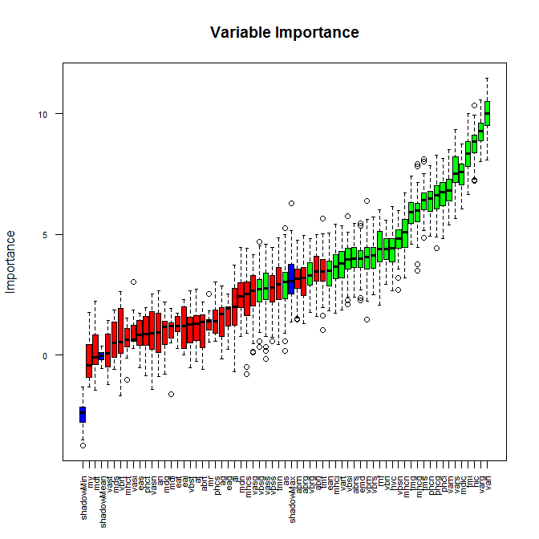<!-- -->

### Importance scores with ATT stats


```r
imps = attStats(roughFixMod)
imps = imps[order(-imps$meanImp),]
rownames(imps)
```

```
##  [1] "vari" "varg" "hic"  "tmi"  "vars" "mdic" "varn" "phci" "phcg" "phcn" "tms"  "tmg"  "mhcg" "mhcn" "vbsn" "rnf"  "vbri" "hvc"  "vbrs" "vbrn" "abrs" "emd"  "vbsi" "vart" "mhci" "abri" "tmt"  "ean"  "vbrg" "abrn" "abrg" "tmn"  "as"   "vbss" "vass"
## [36] "vbsg" "vasg" "mdn"  "mhcs" "ai"   "eag"  "phcs" "ag"   "mr"   "eat"  "at"   "eai"  "vbst" "vasi" "abrt" "an"   "mdi"  "vasn" "phct" "mdg"  "vbrt" "eas"  "mds"  "mhct" "mdt"  "vast" "mv"
```

```r
head(imps)
```

```
##       meanImp medianImp   minImp    maxImp normHits  decision
## vari 9.978837 10.023121 8.090273 11.491599        1 Confirmed
## varg 9.261466  9.296070 8.004088 10.591989        1 Confirmed
## hic  8.753001  8.843166 7.216180 10.358235        1 Confirmed
## tmi  8.320299  8.345862 6.667351  9.999155        1 Confirmed
## vars 7.648440  7.534870 5.671076  9.332766        1 Confirmed
## mdic 7.513680  7.572449 6.039153  8.744353        1 Confirmed
```

## varImp - variable importance

In general, the importance of a variable is computed based on how much the accuracy drops by removing that variable. So, the computed importance is relative and vary based on the modelling algorithm.

The caret package provide the **varImp()** function.

### varImp with rpart model


```r
rPartMod = train(Class ~ ., data = trainData, method = "rpart")
rpartVar = varImp(rPartMod)
rpartVar
```

```
## rpart variable importance
## 
##   only 20 most important variables shown (out of 62)
## 
##      Overall
## varg  100.00
## vari   95.34
## tmi    88.71
## hic    86.32
## varn   83.52
## vbsn    0.00
## ean     0.00
## vasn    0.00
## vbsg    0.00
## abrs    0.00
## mdn     0.00
## eai     0.00
## mhcs    0.00
## phci    0.00
## abrg    0.00
## as      0.00
## mhci    0.00
## eas     0.00
## phcn    0.00
## abrn    0.00
```

### varImp with random forest model


```r
rfMod = train(Class ~ ., data = trainData, method = "rf")
rfVar = varImp(rfMod)
rfVar
```

```
## rf variable importance
## 
##   only 20 most important variables shown (out of 62)
## 
##      Overall
## vari  100.00
## varg   82.47
## hic    69.53
## varn   67.26
## vars   64.34
## tmg    63.58
## phcn   61.75
## tmi    59.43
## mdic   57.67
## rnf    56.86
## phcg   53.67
## hvc    52.92
## abri   52.81
## mhcn   52.23
## vbsi   50.23
## ean    50.20
## tmt    47.56
## phci   46.46
## vbrg   43.70
## emd    43.57
```

## Recursive Feature selection (RFE)

The RFE is a robust that systematically resamples to give an unbiased estimate of variable importance.


```r
# Number of subsets to be retained
subsets = c(1:5, 10, 15, 20, 25, 35, 45, 55)

x = trainData[,-63]
y = trainData[,63]
# Remove high correlated predictors
correls = findCorrelation(cor(x), cutoff = 0.9)
if(length(correls) != 0){x = x[, -correls]}

# Create folds
set.seed(100)
index = createFolds(y , k = 10, returnTrain = T)

# Setting up the control argument
ctrl = rfeControl(functions = rfFuncs
                  , method = "repeatedcv"
                  , repeats = 5
                  , index = index
                  , verbose = TRUE)

# Creating the RFE
rfProfile = rfe(x = x
                , y = y
                , sizes = subsets
                , rfeControl = ctrl)
```

```
## +(rfe) fit Fold01 size: 37 
## -(rfe) fit Fold01 size: 37 
## +(rfe) imp Fold01 
## -(rfe) imp Fold01 
## +(rfe) fit Fold01 size: 35 
## -(rfe) fit Fold01 size: 35 
## +(rfe) fit Fold01 size: 25 
## -(rfe) fit Fold01 size: 25 
## +(rfe) fit Fold01 size: 20 
## -(rfe) fit Fold01 size: 20 
## +(rfe) fit Fold01 size: 15 
## -(rfe) fit Fold01 size: 15 
## +(rfe) fit Fold01 size: 10 
## -(rfe) fit Fold01 size: 10 
## +(rfe) fit Fold01 size:  5 
## -(rfe) fit Fold01 size:  5 
## +(rfe) fit Fold01 size:  4 
## -(rfe) fit Fold01 size:  4 
## +(rfe) fit Fold01 size:  3 
## -(rfe) fit Fold01 size:  3 
## +(rfe) fit Fold01 size:  2 
## -(rfe) fit Fold01 size:  2 
## +(rfe) fit Fold01 size:  1 
## -(rfe) fit Fold01 size:  1 
## +(rfe) fit Fold02 size: 37 
## -(rfe) fit Fold02 size: 37 
## +(rfe) imp Fold02 
## -(rfe) imp Fold02 
## +(rfe) fit Fold02 size: 35 
## -(rfe) fit Fold02 size: 35 
## +(rfe) fit Fold02 size: 25 
## -(rfe) fit Fold02 size: 25 
## +(rfe) fit Fold02 size: 20 
## -(rfe) fit Fold02 size: 20 
## +(rfe) fit Fold02 size: 15 
## -(rfe) fit Fold02 size: 15 
## +(rfe) fit Fold02 size: 10 
## -(rfe) fit Fold02 size: 10 
## +(rfe) fit Fold02 size:  5 
## -(rfe) fit Fold02 size:  5 
## +(rfe) fit Fold02 size:  4 
## -(rfe) fit Fold02 size:  4 
## +(rfe) fit Fold02 size:  3 
## -(rfe) fit Fold02 size:  3 
## +(rfe) fit Fold02 size:  2 
## -(rfe) fit Fold02 size:  2 
## +(rfe) fit Fold02 size:  1 
## -(rfe) fit Fold02 size:  1 
## +(rfe) fit Fold03 size: 37 
## -(rfe) fit Fold03 size: 37 
## +(rfe) imp Fold03 
## -(rfe) imp Fold03 
## +(rfe) fit Fold03 size: 35 
## -(rfe) fit Fold03 size: 35 
## +(rfe) fit Fold03 size: 25 
## -(rfe) fit Fold03 size: 25 
## +(rfe) fit Fold03 size: 20 
## -(rfe) fit Fold03 size: 20 
## +(rfe) fit Fold03 size: 15 
## -(rfe) fit Fold03 size: 15 
## +(rfe) fit Fold03 size: 10 
## -(rfe) fit Fold03 size: 10 
## +(rfe) fit Fold03 size:  5 
## -(rfe) fit Fold03 size:  5 
## +(rfe) fit Fold03 size:  4 
## -(rfe) fit Fold03 size:  4 
## +(rfe) fit Fold03 size:  3 
## -(rfe) fit Fold03 size:  3 
## +(rfe) fit Fold03 size:  2 
## -(rfe) fit Fold03 size:  2 
## +(rfe) fit Fold03 size:  1 
## -(rfe) fit Fold03 size:  1 
## +(rfe) fit Fold04 size: 37 
## -(rfe) fit Fold04 size: 37 
## +(rfe) imp Fold04 
## -(rfe) imp Fold04 
## +(rfe) fit Fold04 size: 35 
## -(rfe) fit Fold04 size: 35 
## +(rfe) fit Fold04 size: 25 
## -(rfe) fit Fold04 size: 25 
## +(rfe) fit Fold04 size: 20 
## -(rfe) fit Fold04 size: 20 
## +(rfe) fit Fold04 size: 15 
## -(rfe) fit Fold04 size: 15 
## +(rfe) fit Fold04 size: 10 
## -(rfe) fit Fold04 size: 10 
## +(rfe) fit Fold04 size:  5 
## -(rfe) fit Fold04 size:  5 
## +(rfe) fit Fold04 size:  4 
## -(rfe) fit Fold04 size:  4 
## +(rfe) fit Fold04 size:  3 
## -(rfe) fit Fold04 size:  3 
## +(rfe) fit Fold04 size:  2 
## -(rfe) fit Fold04 size:  2 
## +(rfe) fit Fold04 size:  1 
## -(rfe) fit Fold04 size:  1 
## +(rfe) fit Fold05 size: 37 
## -(rfe) fit Fold05 size: 37 
## +(rfe) imp Fold05 
## -(rfe) imp Fold05 
## +(rfe) fit Fold05 size: 35 
## -(rfe) fit Fold05 size: 35 
## +(rfe) fit Fold05 size: 25 
## -(rfe) fit Fold05 size: 25 
## +(rfe) fit Fold05 size: 20 
## -(rfe) fit Fold05 size: 20 
## +(rfe) fit Fold05 size: 15 
## -(rfe) fit Fold05 size: 15 
## +(rfe) fit Fold05 size: 10 
## -(rfe) fit Fold05 size: 10 
## +(rfe) fit Fold05 size:  5 
## -(rfe) fit Fold05 size:  5 
## +(rfe) fit Fold05 size:  4 
## -(rfe) fit Fold05 size:  4 
## +(rfe) fit Fold05 size:  3 
## -(rfe) fit Fold05 size:  3 
## +(rfe) fit Fold05 size:  2 
## -(rfe) fit Fold05 size:  2 
## +(rfe) fit Fold05 size:  1 
## -(rfe) fit Fold05 size:  1 
## +(rfe) fit Fold06 size: 37 
## -(rfe) fit Fold06 size: 37 
## +(rfe) imp Fold06 
## -(rfe) imp Fold06 
## +(rfe) fit Fold06 size: 35 
## -(rfe) fit Fold06 size: 35 
## +(rfe) fit Fold06 size: 25 
## -(rfe) fit Fold06 size: 25 
## +(rfe) fit Fold06 size: 20 
## -(rfe) fit Fold06 size: 20 
## +(rfe) fit Fold06 size: 15 
## -(rfe) fit Fold06 size: 15 
## +(rfe) fit Fold06 size: 10 
## -(rfe) fit Fold06 size: 10 
## +(rfe) fit Fold06 size:  5 
## -(rfe) fit Fold06 size:  5 
## +(rfe) fit Fold06 size:  4 
## -(rfe) fit Fold06 size:  4 
## +(rfe) fit Fold06 size:  3 
## -(rfe) fit Fold06 size:  3 
## +(rfe) fit Fold06 size:  2 
## -(rfe) fit Fold06 size:  2 
## +(rfe) fit Fold06 size:  1 
## -(rfe) fit Fold06 size:  1 
## +(rfe) fit Fold07 size: 37 
## -(rfe) fit Fold07 size: 37 
## +(rfe) imp Fold07 
## -(rfe) imp Fold07 
## +(rfe) fit Fold07 size: 35 
## -(rfe) fit Fold07 size: 35 
## +(rfe) fit Fold07 size: 25 
## -(rfe) fit Fold07 size: 25 
## +(rfe) fit Fold07 size: 20 
## -(rfe) fit Fold07 size: 20 
## +(rfe) fit Fold07 size: 15 
## -(rfe) fit Fold07 size: 15 
## +(rfe) fit Fold07 size: 10 
## -(rfe) fit Fold07 size: 10 
## +(rfe) fit Fold07 size:  5 
## -(rfe) fit Fold07 size:  5 
## +(rfe) fit Fold07 size:  4 
## -(rfe) fit Fold07 size:  4 
## +(rfe) fit Fold07 size:  3 
## -(rfe) fit Fold07 size:  3 
## +(rfe) fit Fold07 size:  2 
## -(rfe) fit Fold07 size:  2 
## +(rfe) fit Fold07 size:  1 
## -(rfe) fit Fold07 size:  1 
## +(rfe) fit Fold08 size: 37 
## -(rfe) fit Fold08 size: 37 
## +(rfe) imp Fold08 
## -(rfe) imp Fold08 
## +(rfe) fit Fold08 size: 35 
## -(rfe) fit Fold08 size: 35 
## +(rfe) fit Fold08 size: 25 
## -(rfe) fit Fold08 size: 25 
## +(rfe) fit Fold08 size: 20 
## -(rfe) fit Fold08 size: 20 
## +(rfe) fit Fold08 size: 15 
## -(rfe) fit Fold08 size: 15 
## +(rfe) fit Fold08 size: 10 
## -(rfe) fit Fold08 size: 10 
## +(rfe) fit Fold08 size:  5 
## -(rfe) fit Fold08 size:  5 
## +(rfe) fit Fold08 size:  4 
## -(rfe) fit Fold08 size:  4 
## +(rfe) fit Fold08 size:  3 
## -(rfe) fit Fold08 size:  3 
## +(rfe) fit Fold08 size:  2 
## -(rfe) fit Fold08 size:  2 
## +(rfe) fit Fold08 size:  1 
## -(rfe) fit Fold08 size:  1 
## +(rfe) fit Fold09 size: 37 
## -(rfe) fit Fold09 size: 37 
## +(rfe) imp Fold09 
## -(rfe) imp Fold09 
## +(rfe) fit Fold09 size: 35 
## -(rfe) fit Fold09 size: 35 
## +(rfe) fit Fold09 size: 25 
## -(rfe) fit Fold09 size: 25 
## +(rfe) fit Fold09 size: 20 
## -(rfe) fit Fold09 size: 20 
## +(rfe) fit Fold09 size: 15 
## -(rfe) fit Fold09 size: 15 
## +(rfe) fit Fold09 size: 10 
## -(rfe) fit Fold09 size: 10 
## +(rfe) fit Fold09 size:  5 
## -(rfe) fit Fold09 size:  5 
## +(rfe) fit Fold09 size:  4 
## -(rfe) fit Fold09 size:  4 
## +(rfe) fit Fold09 size:  3 
## -(rfe) fit Fold09 size:  3 
## +(rfe) fit Fold09 size:  2 
## -(rfe) fit Fold09 size:  2 
## +(rfe) fit Fold09 size:  1 
## -(rfe) fit Fold09 size:  1 
## +(rfe) fit Fold10 size: 37 
## -(rfe) fit Fold10 size: 37 
## +(rfe) imp Fold10 
## -(rfe) imp Fold10 
## +(rfe) fit Fold10 size: 35 
## -(rfe) fit Fold10 size: 35 
## +(rfe) fit Fold10 size: 25 
## -(rfe) fit Fold10 size: 25 
## +(rfe) fit Fold10 size: 20 
## -(rfe) fit Fold10 size: 20 
## +(rfe) fit Fold10 size: 15 
## -(rfe) fit Fold10 size: 15 
## +(rfe) fit Fold10 size: 10 
## -(rfe) fit Fold10 size: 10 
## +(rfe) fit Fold10 size:  5 
## -(rfe) fit Fold10 size:  5 
## +(rfe) fit Fold10 size:  4 
## -(rfe) fit Fold10 size:  4 
## +(rfe) fit Fold10 size:  3 
## -(rfe) fit Fold10 size:  3 
## +(rfe) fit Fold10 size:  2 
## -(rfe) fit Fold10 size:  2 
## +(rfe) fit Fold10 size:  1 
## -(rfe) fit Fold10 size:  1
```

```r
# Checking the variable importance
varImp(rfProfile)
```

```
##       Overall
## vari 8.871799
## hic  8.136998
## tmi  7.409560
## vars 7.166821
## varn 6.146241
## phcg 5.727230
## phci 5.354138
## tms  5.064125
## phcn 5.044314
## tmg  4.855107
## hvc  4.667472
## mhcg 4.423573
## mhcn 4.202672
## vbrn 4.046935
## rnf  3.999882
## emd  3.921490
## mhci 3.773424
## mdn  3.487134
## vbss 3.458770
## tmt  3.404746
## abri 3.403423
## ean  3.355958
## vart 3.305280
## vasg 3.232743
## tmn  3.231133
## mhcs 2.972729
```

```r
rfProfile
```

```
## 
## Recursive feature selection
## 
## Outer resampling method: Cross-Validated (10 fold, repeated 5 times) 
## 
## Resampling performance over subset size:
## 
##  Variables Accuracy  Kappa AccuracySD KappaSD Selected
##          1   0.6533 0.3065    0.06899 0.13826         
##          2   0.8115 0.6239    0.06926 0.13865         
##          3   0.7901 0.5821    0.06177 0.12367         
##          4   0.8104 0.6218    0.07364 0.14717         
##          5   0.8324 0.6664    0.06223 0.12272         
##         10   0.8187 0.6392    0.05128 0.10155         
##         15   0.8187 0.6392    0.06998 0.13922         
##         20   0.8407 0.6824    0.04464 0.08945        *
##         25   0.8264 0.6538    0.03525 0.07120         
##         35   0.8258 0.6535    0.05115 0.10100         
##         37   0.8187 0.6392    0.03868 0.07601         
## 
## The top 5 variables (out of 20):
##    vari, hic, tmi, vars, varn
```

